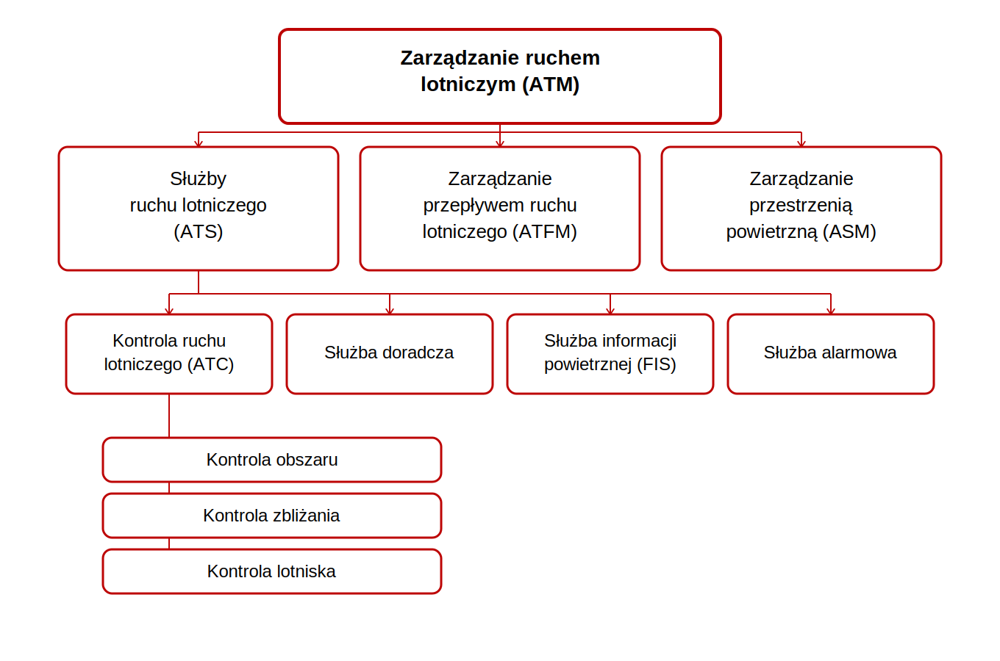

# Zarządzanie ruchem lotniczym

Kontroler ruchu lotniczego, także ten wirtualny w sieci Vatsim, pracuje w ramach ściśle określonej, choć niewidocznej na pierwszy rzut oka struktury organizacyjnej. Struktura ta, funkcjonująca pod nazwą 'zarządzanie ruchem lotniczym', ma na celu uporządkowanie w ramach prawnych najważniejszych aspektów związanych z wykonywaniem operacji lotniczych. Wiedza o współdziałaniu, wzajemnych interakcjach i zależnościach zachodzących między poszczególnymi elementami jest bardzo pomocne w zrozumieniu systemu, w ramach którego funkcjonuje kontroler ruchu lotniczego. Zacznijmy od oficjalnej definicji pochodzące wprost z Doc 4444:

> **Zarządzanie ruchem lotniczym (ATM)** (_Air traffic management_) - dynamiczne, zintegrowane zarządzanie ruchem lotniczym i przestrzenią powietrzną – w sposób bezpieczny, ekonomiczny i sprawny – przez zapewnienie urządzeń i jednolitych służb współdziałających ze sobą.

Trzeba przyznać, że nie jest to najbardziej klarowna i czytelna definicja. Sytuacja ulega znacznej poprawie po odwołaniu się do definicji z [Rozporządzenia (WE) nr 549/2004 ustanawiającego ramy tworzenia Jednolitej Europejskiej Przestrzeni Powietrznej](https://eur-lex.europa.eu/legal-content/PL/TXT/?uri=CELEX:32004R0549) (_Single European Sky, SES_):

> **"Zarządzanie ruchem lotniczym** oznacza połączenie funkcji pokładowych i naziemnych (służby ruchu lotniczego, zarządzanie przestrzenią powietrzną i zarządzanie przepływem ruchu lotniczego) wymaganych dla zapewnienia bezpiecznego i skutecznego ruchu statków powietrznych podczas wszystkich faz operacji;

Teraz w głowie może budować się już ogólny zarys, o co w tym całym zarządzaniu chodzi. Kropkę nad i powinien postawić rzut okiem na schemat organizacyjny:

Widać więc, że zarządzanie ruchem lotniczym jest systemem składającym się z trzech podstawowych elementów:
- Zarządzanie przestrzenią powietrzną - odpowiada za projektowanie całokształtu przestrzeni, w której wykonuje się operacje lotnicze;
- Zarządzanie przepływem ruchu lotniczego - odpowiada za monitorowanie natężenia ruchu w podległych przestzreniach i zapobieganie przeciążenia sektorów ATC;
- Słuzby ruchu lotniczego - sprawują operacyjny nadzór nad bieżącymi operacjami lotniczymi.

## Służby ruchu lotniczego

Służby ruchu lotniczego to pojęcie ogólne, w skład którego wchodzą:
> **Służba kontroli ruchu lotniczego** (_Air traffic control service_): Służba ustanowiona w celu:
>   - zapobiegania kolizjom:
>     - między statkami powietrznymi w locie;
>     - statków powietrznych na polu manewrowym: z przeszkodami i innymi statkami powietrznymi; i
>   - usprawniania i utrzymywania uporządkowanego przepływu ruchu lotniczego.

> **Służba informacji powietrznej** (_Flight information service_): Służba ustanowiona w celu udzielania wskazówek i informacji użytecznych dla bezpiecznego i sprawnego wykonywania lotów.

> **Służba alarmowa** (_Alerting service_). Służba ustanowiona w celu zawiadamiania właściwych organizacji o statkach powietrznych potrzebujących pomocy w zakresie poszukiwania i ratownictwa oraz w celu współdziałania z tymi organizacjami w razie potrzeby.

> **Służba doradcza** (_Air traffic advisory service_): Służba zapewniana w przestrzeni powietrznej ze służbą doradczą w celu zapewnienia w miarę możliwości separacji między statkami powietrznymi wykonującymi loty według planów lotu IFR. **_W polskiej przestrzeni powietrznej służba doradcza nie jest zapewniana_**

Nas oczywiście najbardziej interesuje służba kontroli ruchu lotniczego. Można ją podzielić dalej na służbę kontroli obszaru, służbę kontroli zbliżania i służbę kontroli lotniska. Warto zwrócić uwagę, że możliwe są tu delegacje odpowiedzialności, tzn. służba kontroli zbliżania może być zapewniana przez kontrolera wieżowego (przykładem są występujące w Polsce lotniska z proceduralną kontrolą zbliżania), a służba kontroli obszaru może być zapewniana przez kontrolera zbliżania. Dokładne opisy zadań konkretnych służb zostaną opisane w dalszych modułach szkoleniowych.

W tym miejscu warto przytoczyć jeszcze jedną definicję, która pozwoli uszczegółowić zakres służb pełnionych przez kontrolę ruchu lotniczego:

> **Rejon informacji powietrznej** (_Flight Information Region, FIR_) - przestrzeń powietrzna o określonych wymiarach, w której zapewniona jest służba informacji powietrznej i służba alarmowa

Z definicji tej wynika, że w FIR Warszawa kontrolerzy zapewniają nie tylko służbę kontroli ruchu lotniczego, ale też służbę informacji powietrznej oraz służbę alarmową. O ile służba ATC i FIS zapewniana jest tylko w ramach przestrzeni odpowiedzialności danego kontrolera (z poprawką na zasadę top-down na Vatsim), o tyle służbę alarmową pełni się wobec wszystkich statków powietrznych, o których wiadomo, że znajdują się w niebezpieczeństwie. W związku z tym kontroler nie może zignorować sytuacji niebezpiecznej, o której wie, nawet jeżeli zagrożony statek powietrzny znajduje się poza jego sektorem.

:::info
Warto rozróżnić pojęcia służby kontroli ruchu lotniczego od organu kontroli ruchu lotniczego:
- służba kontroli ruchu lotniczego to pojęcie ogólne stosowane w przepisach
- organ kontroli ruchu lotniczego oznacza konkretną jednostkę, która implementuje przepisy ustanowione dla danej słuzby oraz specyficzne dla siebie procedury lokalne, np. Kraków Wieża, Poznań Zbliżanie
:::

## Zarządzanie przepływem ruchu lotniczego

> **Zarządzanie przepływem ruchu lotniczego** (_Air traffic flow management, ATFM_): Służba ustanowiona w celu
przyczyniania się do bezpiecznego, uporządkowanego i szybkiego przepływu ruchu lotniczego poprzez
zapewnianie wykorzystania w maksymalnym stopniu pojemności ATC i aby wielkość tego ruchu była zgodna z
pojemnością deklarowaną przez właściwy organ ATS.

Najprościej mówiąc służba ATFM odpowiada za zapewnienienie maksymalnej przepustowości systemu ATM oraz niedopuszczanie do przekroczenia pojemności sektorowych, a co za tym idzie do niebezpiecznego przeciążenia pracą kontrolerów ruchu lotniczego. To właśnie ta służba odpowiada za regulowanie odlotów statków powietrznych poprzez przydzielanie slotów (_Calculated Take Off Time, CTOT_). Innymi metodami regulowania ruchu są między innymi _rerouting_ (proponowanie alternatywnych tras omijających przeciążone sektory) czy _level capping_ (ograniczanie dostępnych poziomów przelotowych). Z innych ciekawych zadań wymienić można:
- opracowywanie scenariuszy mitygujących dla wydarzeń generujących duże natężenie ruchu lotniczego w krótkim czasie, takich jak wydarzenia sportowe czy imprezy masowe. 
- zarządzanie przepływem ruchu w przypadku wydarzeń losowych, takich jak awarie infrastruktury czy zjawiska pogodowe
- współpraca z krajowymi organami zapewniającymi służby ruchu lotniczego w celu optymalizacji struktur przestrzeni powietrznej i dopasowanie do potoków ruchu lotniczego

Dużo ciekawych informacji (w tym aktualne restrykcje i poziom obciążenia poszczególnych sektorów) można znaleźć na stronie [Network Manager Operations Center](https://www.public.nm.eurocontrol.int/PUBPORTAL/gateway/spec/index.html) - organu ATFM działającego z ramienia Eurocontrol i sprawującego nadzór nad europejską przestrzenią powietrzną.

Na Vatsim ATFM działa w zdecydowanie bardziej ograniczonej formie, ale jest w fazie bardzo dynamicznego rozwoju. Część państw, w tym Polska, dołączyła do inicjatywy VATSIM Spain i korzystania z narzędzia vIFF symulującego zarządzanie przepływem ruchu lotniczego w sieci. Więcej informacji można znaleźć na stronie projektu: [https://cdm.vatsimspain.es/](https://cdm.vatsimspain.es/)

:::info
Na VATSIM przepływ ruchu lotniczego, a co za tym idzie przydzielanie slotów, realizowane jest przez plugin CDM. Powoduje to niefortunne pomieszanie pojęć i odpowiedzialności za poszczególne obszary. Warto wobec tego znać realne znaczenie poszczególnych akronimów i rozróżniać, do jakiego obszaru zarządzania ruchem lotniczym faktycznie się odnoszą:

**ACDM** (_Airport Collaborative Decision Making_) jest systemem lokalnym działającym w ramach jednego lotniska. Jego celem jest przede wszystkim poprawa przewidywalności operacji poprzez wymianę precyzyjnych czasów (TOBT, TSAT, TTOT) między wszystkimi podmiotami zaangażowanymi w daną operację lotniczą (przewoźnik, handling, kontrola ruchu lotniczego czy zarządzający lotniskiem)

**ATFM** działa w skali międzynarodowej. W przypadku wystąpienia utrudnień lub przewidywanych przekroczeń pojemności sektorowych reguluje ruch między innymi przez przydzielanie czasów CTOT. Wynika z tego, że czas CTOT może otrzymać statek powietrzny odlatujący z lotniska, na którym nie funkcjonuje system ACDM.
:::

## Zarządzanie przestrzenią powietrzną

Ostatnim elementem systemu ATM jest zarządzanie przestrzenią powietrzną (_Airspace management, ASM_). Głównym celem ASM jest projektowanie i zarządzanie elementami przestrzeni powietrznej tak, aby sprostać wymaganiom użytkowników, tak cywilnych, jak i wojskowych. Do pogodzenia są więc bardzo różne, czasem wykluczające się wymagania. Przykładowo, liniom lotniczym będzie zależało na istnieniu ściśle regulowanej, a przez to bezpiecznej i efektywnej przestrzeni sprzyjającej prowadzeniu działalności biznesowej, w tym na możliwie najkrótszych i najbardziej bezpośrednich trasach. Lotnictwo ogólne (General Aviation) będzie z kolei zainteresowane jak najszerszym i możliwie nieskrępowanym dostępem do przestrzeni powietrznej, łatwością planowania lotów oraz ograniczeniem stref wymagających specjalnych zezwoleń. Wojsko natomiast potrzebuje regularnego dostępu do rozległych, rezerwowanych na wyłączność stref umożliwiających prowadzenie ćwiczeń, lotów szkoleniowych i operacji wymagających manewrów niekompatybilnych z ruchem cywilnym (np. lotów z dużymi prędkościami, na małych wysokościach czy z użyciem uzbrojenia). 
Cel ten osiąga się przez tak zwane elastyczne zarządzanie przestrzenią powietrzną. Poza stałymi elementami, które funkcjonują permanentnie (np. TMA Warszawa), dostępnych jest szereg struktur aktywowanych okresowo w odpowiedzi na zapotrzebowanie użytkowników. Przykładem mogą być warunkowe drogi lotnicze (aktywne według ustalonego harmonogramu), przestrzenie zarezerwowane na pokazy lotnicze czy ćwiczenia wojskowe.

Na Vatsim w vFIR Warszawa ASM ma charakter statyczny i ogranicza się do cyklicznego aktualizowania stałych elementów przestrzeni zgodnie z realnie wprowadzanymi zmianami. Nie symuluje się elastycznych struktur aktywowanych doraźnie, takich jak przykładowo strefy segregowane (_Temporary Segregated Area, TSA_) czy strefy czasowo rezerwowane (Temporary Reserved Area, TRA).

## Źródła
- [Doc 4444 - Procedury służb żeglugi powietrznej - zarządzanie ruchem lotniczym](https://edziennik.ulc.gov.pl/DU_ULC/2025/40/oryginal/akt.pdf)
- [Załącznik 11 do konwencji o międzynarodowym lotnictwie cywilnym - służby ruchu lotniczego](https://caa.gov.pl/_download/prawo/prawo_miedzynarodowe/Zalacznik_11_wyd_15_popr_1-54.pdf) 
- [Rozporządzenie wykonawcze Komisji (UE) 2017/373 z dnia 1 marca 2017 ustanawiające wspólne wymogi dotyczące instytucji zapewniających zarządzanie ruchem lotniczym](https://eur-lex.europa.eu/legal-content/PL/TXT/?uri=CELEX:32017R0373)