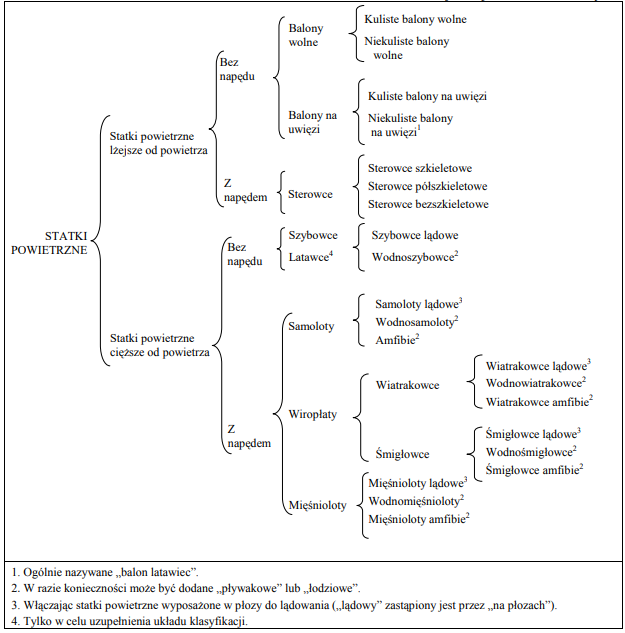

# Klasyfikacja statków powietrznych

może na początek mozaika zdjęć z różnymi typami pokazująca różnorodność? zwykły jet, coś GA, belfegor, osprey, wielopłat, wirnikowiec, sterowiec, balon, dron itd

Chlebem powszednim kontrolera ruchu lotniczego jest obsługa statków powietrznch. Nie da się poprawnie wykonywać swoich zadań bez ogólnej wiedzy o tym, jak statki powietrzne się dzielą, jak działają, jakie mają możliwości czy ograniczenia. 

:::danger
pomysl czy nie wydzielic rzeczy z DOC8643 do osobnego artykulu, a klasyfikacji z zalacznika 7 do osobnego
:::

Informacje te ważne są dla każdej ze służb, bez względu czy to wieża, czy kontrola obszaru. Czy dany typ może skorzystać z danej drogi kołowania? Czy będzie w stanie utrzymywać narzuconą prędkość podczas podejścia? Czy jest sens pytać pilota, czy będzie w stanie wznieść się na FL410? To pytania, na które należy potrafić odpowiedzieć, żeby wykonywać swoje zadania sprawnie i bezpiecznie. 

Dobrze zatem zdefiniować, czym ów statek powietrzny jest, jakie są rodzaje statków powietrznych, czym charakteryzują się poszczególne kategorie, czy czego możemy się po danym typie spodziewać. Zgodnie z ustawą prawo lotnicze **dodaj pełną nazwę + źródło na koniec**

> Statkiem powietrznym jest urządzenie zdolne do unoszenia się w atmosferze na skutek oddziaływania powietrza innego niż oddziaływanie powietrza odbitego od podłoża
 
Taka definicja wyklucza z grona statków powietrznych wszelkiego rodzaju poduszkowce czy ekranoplany.

Z pomocą w klasyfikacji przychodzi Załącznik 7 do Konwencji Chicagowskiej, o dosyć zaskakującym tytule: "Znaki Przynależności Państwowej oraz Rejestracyjne". W rozdziale 2 przedstawiona jest następująca hierarchia:

Podstawowy podział przebiega po lini ciężaru względem powietrza.

Statki powietrzne lżejsze od powietrza, zwane też **aerostatami**. W tej kategorii lądują wszelkiego rodzaju balony i sterowce, czyli maszyny wykorzystujące siłę wyporu jako podstawowy mechanizm pozwalający na wzbicie się w powietrze. Może to być czasza balonu wypełniona gorącym, lekkim powietrzem, albo sterowiec wypełniony helem. Ciekawostką jest fakt, że dziecięcy balon z helem również jest statkiem powietrznym.

Statki powietrzne cięższe od powietrza, zwane też **aerodynami**. To ta kategoria zawierać będzie ogromną większość maszyn, z którymi będziesz miał styczność jako kontroler. Samoloty, śmigłowce czy coraz częściej spotykane na VATSIM szybowce. Maszyny te generują siłę nośną, używając skrzydeł. 

Mówiąc o statkach powietrznych kontrolerzy najczęściej używają kodów ICAO zdefiniowanych w **Doc 8643 – Aircraft Type Designators**. To tam sprawdzimy i dowiemy się, że BCS3 to Airbus 220, A21N to Airbus A320 Neo, a planowany kod dla Boeinga 737-1000 Max to B3XM.

Poza kodem ICAO każdy statek powietrzny ma przypisany opis składający się z 3 znaków:
- Typ statku powietrznego.
- Ilość silników.
- Rodzaj silników.

Przykładowo, samoloty takie jak [Cessna Citation](https://learningzone.eurocontrol.int/ilp/customs/ATCPFDB/details.aspx?ICAO=C56X&ICAOFilter=c56x), [Boeing 737-800](https://learningzone.eurocontrol.int/ilp/customs/ATCPFDB/details.aspx?ICAO=B738&ICAOFilter=b738) czy [Airbus A350](https://learningzone.eurocontrol.int/ilp/customs/ATCPFDB/details.aspx?ICAO=A359&ICAOFilter=a359) będą, mimo bardzo różnych charakterystyk, dzielić ten sam kod: **L2J**. Landplane, 2 Jet engines.

Więcej na ten temat można przeczytać na [Skybrary](https://skybrary.aero/articles/aircraft-description-icao-doc-8643) 

Świetnym zasobem pozwalającym szybko sprawdzić osiągi danego statku powietrznego jest strona [Aircraft Performance Database](https://learningzone.eurocontrol.int/ilp/customs/ATCPFDB/default.aspx?). Po wpisaniu kodu ICAO statku powietrznego możemy na przejrzystych wykresach sprawdzić wygląd, typowe prędkości, kategorie, masy czy charakterystyczne rozmiary, przykładowo [Airbus A321](https://learningzone.eurocontrol.int/ilp/customs/ATCPFDB/details.aspx?ICAO=A321) 

draft

źródła

1. załącznik 7 strona 3 https://caa.gov.pl/_download/prawo/prawo_miedzynarodowe/konwencje/zalacznik_7_icao-1.pdf
2. ROZPORZĄDZENIE MINISTRA INFRASTRUKTURY 1 z dnia 5 sierpnia 2022 r. w sprawie klasyfikacji statków powietrznych https://sip.lex.pl/akty-prawne/dzu-dziennik-ustaw/klasyfikacja-statkow-powietrznych-21719110 - dodaj link bezposrednio do rzadowego dziennkia

