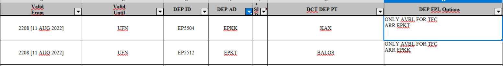

# Instytucje międzynarodowe w kontekście VATSIM

Lotnictwo od dawna opiera się na międzynarodowej współpracy. Jej przejawem w lotnictwie rzeczywistym są organizacje międzynarodowe (międzyrządowe) działające na podstawie umów międzynarodowych. Z kolei sieć VATSIM oparta jest na hierarchii, w której organizacje krajowe (subdywizje) tworzą większe struktury.

## Instytucje VATSIM

Najważniejszym organem VATSIM jest zarząd ([*Board of Governors*](https://vatsim.net/docs/staff/bog)), którego kompetencje określone są w Code of Regulations (CoR). Jednak większość decyzji wpływających bezpośrednio na sytuację pilotów i kontrolerów podejmowana jest na niższym szczeblu. Obecnie VATSIM dzieli się na trzy regiony (Americas, Asia Pacific oraz Europe, Middle East, Africa, czyli *EMEA*), które następnie dzielą się na dywizje.

Ponad dwie trzecie członków z regionu EMEA należy do Europe Divison (**VATEUD**). Obejmuje ona kraje europejskie oprócz Zjednoczonego Królestwa (do UK Division, czyli VATUK, należy blisko co czwarty użytkownik VATSIM z regionu EMEA) oraz Rosji i Białorusi (należących do Russian Division, czyli VATRUS). Pozostałe dywizje należące do regionu EMEA to Israel Division (VATIL) obejmująca wyłącznie Izrael, Middle East & North Africa Division (VATMENA) obejmująca kraje Zatoki Perskiej, Bliskiego Wschodu i północnej Afryki, oraz Sub-Sahara Africa Division (VATSSA), która obejmuje obszar Afryki Subsaharyjskiej.

Do VATEUD należy obecnie ponad 20 subdywizji. Większość z nich obejmuje pojedyncze kraje, choć są wyjątki (VATSIM Scandinavia obejmuje pięć państw na północy Europy, VATAdria sześć państw bałkańskich, a Belux vACC obejmuje Belgię i Luksemburg). **Polish vACC**, czyli PLVACC, jest jedną z subdywizji w ramach VATEUD.

Struktura VATSIM jest hierarchiczna, a zatem reguły obowiązujące w subdywizjach muszą być zgodne z regułami ustalonymi w ramach dywizji, i tak dalej.

## Najważniejsze instytucje w rzeczywistym lotnictwie

### ICAO

ICAO to skrót nazwy **International Civil Aviation Organization**, czyli Organizacji Międzynarodowego Lotnictwa Cywilnego. ICAO działa od 1944 r. na podstawie konwencji chicagowskiej i jest częścią systemu ONZ. ICAO zrzesza obecnie ponad 190 państw. Polska należy do tej organizacji od 1958 r.

Z punktu widzenia VATSIM, najważniejsze zadania ICAO wiążą się z ustanawianiem standardów obowiązujących w lotnictwie. To tej organizacji zawdzięczamy przyjęte [nazewnictwo lotnisk](https://en.wikipedia.org/wiki/ICAO_airport_code) (czteroliterowe skróty takie jak EPWA), [linii lotniczych](https://en.wikipedia.org/wiki/Airline_codes#ICAO_airline_designator) (trzyliterowe skróty takie jak BAW i znaki wywoławcze takie jak *Speedbird*) i [statków powietrznych](https://en.wikipedia.org/wiki/List_of_aircraft_type_designators) (np. A20N jako Airbus A320neo), a także procedury, w tym ważny dla nas [Doc 4444](https://ulc.gov.pl/_download/lotniska/drogi-startowe/kompendium/Doc_4444_pl.pdf).

### EASA

EASA, czyli **European Union Aviation Safety Agency** to Agencja Unii Europejskiej ds. Bezpieczeństwa Lotniczego. Jest instytucją Unii Europejskiej odpowiedzialną za bezpieczeństwo lotnicze w Europie. Należą do niej wszystkie państwa członkowskie UE oraz cztery państwa członkowskie Europejskiego Stowarzyszenia Wolnego Handlu (Islandia, Liechtenstein, Norwegia i Szwajcaria).

Ze względu na specyfikę sieci VATSIM i przyjęte w niej uproszczenia, wiele przepisów przyjmowanych w wyniku działalności EASA, nie ma zastosowania w naszej sieci. Przykładowo, nie interesują nas regulacje dotyczące zdatności do lotu statków powietrznych czy ochrony środowiska. Są jednak takie, które staramy się wdrażać w symulowanej rzeczywistości, zgodnie z maksymą *as real as it gets*. Jednym z nich jest [*SERA (Standardized European Rules of the Air)*](https://eur-lex.europa.eu/legal-content/PL/ALL/?uri=CELEX%3A32012R0923) ujednolicające przepisy lotnicze w państwach UE. Kolejny to [*Air Traffic Management/Air Navigation Services — Provision of Services (ATM/ANS) — Provision of Services*](https://www.easa.europa.eu/sites/default/files/dfu/Easy_Access_Rules_for_ATM-ANS.pdf), którego załącznik IV określa wymagania dla instytucji zapewniających służby ruchu lotniczego. Wiele z tych wymagań dokładnie pokrywa się z tymi wynikającymi z Doc 4444, ale dzięki włączeniu do rozporządzenia stały się wiążącymi normami prawnymi. Dzięki EASA przyjęto też [przepisy dotyczące certyfikacji kontrolerów ruchu lotniczego](https://eur-lex.europa.eu/legal-content/PL/TXT/HTML/?uri=CELEX:32015R0340). Program szkolenia w PLVACC, choć oczywiście zdecydowanie mniej obszerny, zaprojektowaliśmy inspirując się tymi przepisami.

:::info
Choć formalnie przytoczone wyżej rozporządzenia są przyjmowane przez Komisję Europejską, to EASA odgrywa kluczową rolę w ich postawaniu, [tworząc projekty](https://www.easa.europa.eu/en/light/topics/easas-regulatory-role-increasing-safety-environmental-protection-and-enabling), na podstawie których rozpoczyna się procedura prawodawcza. Gdy takie przepisy wchodzą w życie, EASA wydaje dokumenty takie jak *Acceptable Means of Compliance* (*AMC*), na które można powołać się, by wykazać zgodność z przepisami, czy *Guidance Material* (*GM*), czyli wyjaśnienia. AMC i GM należą do tzw. miękkiego prawa, czyli nie są bezwzględnie wiążące, ale mają istotny wpływ na to, jak prawo stosowane jest w praktyce. 
:::

### Eurocontrol

Eurocontrol (czasem pisane jako EUROCONTROL) to **European Organisation for the Safety of Air Navigation**, czyli Europejska Organizacja ds. Bezpieczeństwa Żeglugi Powietrznej. Nie jest to instytucja Unii Europejskiej, lecz organizacja międzyrządowa, zrzeszająca obecnie 41 państw. 

Z punktu widzenia VATSIM ważnym wynikiem działalności Eurocontrol jest [*Free Route Airspace*](https://www.eurocontrol.int/concept/free-route-airspace), czyli *FRA*. W uproszczeniu jest to przestrzeń powietrzna, w ramach której można zaplanować lot bez wykorzystywania sieci wyznaczonych dróg lotniczych, ale bezpośrednio pomiędzy zdefiniowanymi punktami nawigacyjnymi. Od kilku lat FRA funkcjonuje też w Polsce w całej przestrzeni powyżej FL95 z wyłączeniem TMA (więcej informacji na ten temat znajdzisz w AIP IFR, ENR 6.2).

Eurocontrol publikuje też na bieżąco [*Route Availability Document*](https://www.nm.eurocontrol.int/RAD/) (*RAD*), zawierający informacje o zasadach planowania tras i zarządzania przestrzenią powietrzną w Europie. Wiele postanowień tego dokumentu nie ma zastosowania na VATSIM, ale warty uwagi jest załącznik 3 określający reguły i ograniczenia dla bezpośrednich połączeń (DCT).

:::info
Zgodnie z załącznikiem 3A do RAD, od 11 sierpnia 2022 r. loty na trasie EPKK-EPKT mogą być planowane na trasie obejmującej tylko *KAX*, a loty na trasie EPKT-EPKK można na planować na trasie obejmującej sam punkt *BALOS*. Posługiwanie się tego typu skrótami jest dopuszczalne przy planowaniu lotów na VATSIM.

*Źródło: [Eurocontrol / RAD AIRAC 2606, V1.29](https://www.nm.eurocontrol.int/RAD/)*
:::

