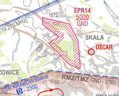
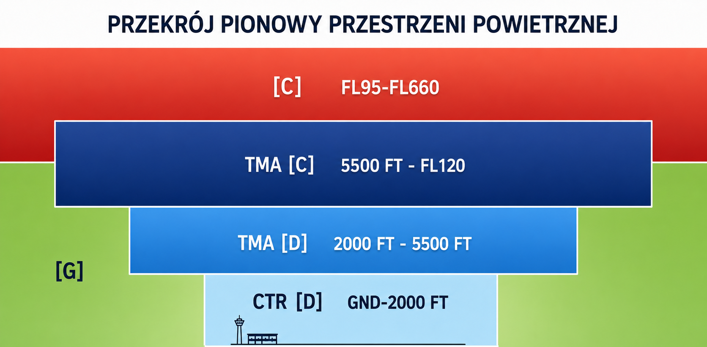
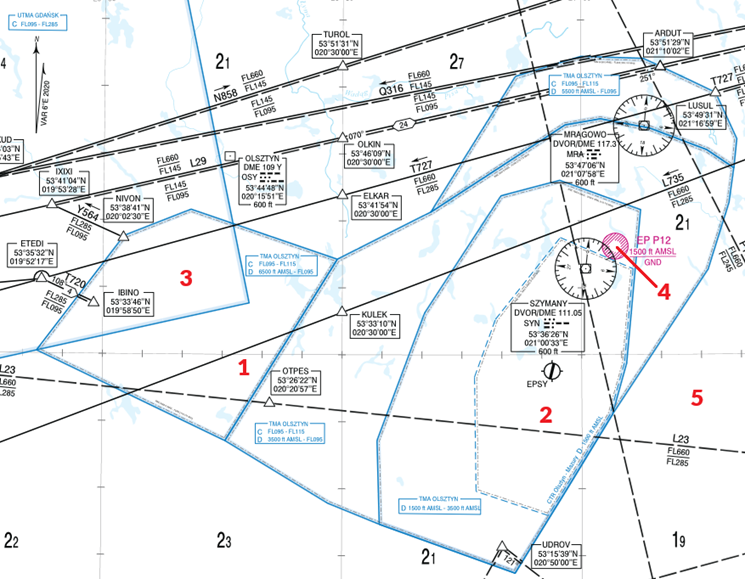

# Przestrzeń powietrzna

Przestrzeń powietrzna to po prostu wycinek atmosfery. Ruch statków powietrznych od startu do lądowania z definicji odbywa się właśnie w  przestrzeni powietrznej. Cechy tej przestrzeni w danym miejscu decydują między innymi o tym, czy lot w ogóle jest dopuszczalny, według jakich przepisów można go wykonywać (tylko IFR, czy także VFR), czy zapewniana jest służba kontroli ruchu lotniczego, czy też na jakich zasadach statkom powietrznym w przestrzeni kontrolowanej zapewniana jest separacja. Zarówno z punktu widzenia kontrolera, jak i pilota, ogromne znaczenie ma umiejętność interpretacji map, czyli przede wszystkim przełożenia ich na trójwymiarowy obraz przestrzeni. Jako kontroler musisz na tej podstawie ustalić zarówno własne zadania, jak i być w stanie reagować, jeśli załoga statku powietrznego naruszy swoje obowiązki (np. bez zezwolenia wleci do przestrzeni kontrolowanej).

## Definicje

> **przestrzeń powietrzna kontrolowana** (*controlled airspace*) - przestrzeń powietrzna o określonych wymiarach, w której służba kontroli ruchu lotniczego jest zapewniana zgodnie z klasyfikacją przestrzeni powietrznej 

Na terenie Polski przestrzeń niekontrolowana obejmuje przestrzeń od powierzchni ziemi do FL95 oprócz tych elementów, które stanowią przestrzeń kontrolowaną (w realiach VATSIM: CTR i TMA). Pomijamy tu wyjątki specyficzne dla ruchu wojskowego.

> **strefa kontrolowana lotniska** (*control zone* lub *CTR*) - kontrolowana przestrzeń powietrzna rozciągająca się od powierzchni ziemi do określonej górnej granicy.

CTR ma zabezpieczać manewry podejścia do lądowania, startu i nabrania wysokości. Dlatego obejmuje lotnisko i bezpośrednio otaczającą je przestrzeń i z definicji rozciąga się od powierzchni ziemi. Górna granica CTR wyznaczana jest indywidualnie. Przykładowo, CTR lotniska Kraków-Balice sięga do wysokości 2300 stóp.

> **obszar kontrolowany** (*control area* lub *CTA*) - kontrolowana przestrzeń powietrzna rozciągająca się w górę od określonej granicy nad ziemią.

Obszar kontrolowany nie musi sięgać powierzchni ziemi i z reguły tak nie jest. Przykładem obszaru kontrolowanego jest rejon kontrolowany lotniska (*Terminal Maneuvering Area* lub *TMA*), który ustanawia się w pobliżu jednego lub kilku lotnisk. Do obszarów kontrolowanych zaliczamy także *drogi lotnicze* stałe (*airway*) lub warunkowe (*conditional route*), przy czym na VATSIM obecnie nie symulujemy warunkowego charakteru tych ostatnich.

Obszarem kontrolowanym na terenie Polski jest też niewchodząca w skład innych kategorii przestrzeń rozciągająca się od FL95 do FL660 (z wyjątkami specyficznymi dla ruchu wojskowego, których tu nie omawiamy).

:::caution
Zarówno CTR, jak i obszary kontrolowane (w tym TMA) z definicji zaliczamy do przestrzeni kontrolowanej.
:::

> **strefa ruchu lotniskowego** (*aerodrome traffic zone* lub *ATZ*) - przestrzeń powietrzna o określonych wymiarach, ustanowiona wokół lotniska dla ochrony ruchu lotniskowego.

ATZ to przestrzeń niekontrolowana, wyznaczona nad lotniskiem niekontrolowanym oraz przylegającym terenem. W Polsce znajdziesz takie przestrzenie wokół niewielkich lotnisk takich jak Pobiednik Wielki (EPKP) czy Babice (EPBC).

> **strefa zakazana** (*P* lub *prohibited area*) - przestrzeń powietrzna o określonych wymiarach nad obszarami lądowymi lub wodami terytorialnymi państwa, w której loty statków powietrznych są zabronione.

> **strefa niebezpieczna** (*D* lub *danger zone*) - przestrzeń powietrzna o określonych wymiarach, w której w danym czasie mogą odbywać się działania niebezpieczne dla lotów statków powietrznych (np. ćwiczenia na poligonie wojskowym).

> **strefa ograniczona** (*R* lub *restricted area*) - przestrzeń powietrzna o określonych wymiarach nad obszarami lądowymi lub wodami terytorialnymi państwa, w której loty statków powietrznych są ograniczone zgodnie z pewnymi określonymi warunkami.

:::info
Na terenie Polski strefy, o których tu mowa, rozpoznasz na mapach po skrócie w formacie EPXn, gdzie *X* to typ strefy, a *n* to jej numer. Przykładowo, EPP20 to strefa zakazana wyznaczona wokół muzeum KL Auschwitz-Birkenau, EPD24 to strefa niebezpieczna wokół poligonu w Drawsku Pomorskim, a EPR14, niedaleko na północ od lotniska Kraków-Balice, to strefa ograniczona chroniąca Ojcowski Park Narodowy.

*Źródło: AIP IFR, AD 2 EPKK 13-1, 16.4.2026*
:::

> **strefa obowiązkowej łączności radiowej** (*RMZ*) - przestrzeń powietrzna o określonych wymiarach, w której obowiązkowe jest posiadanie na wyposażeniu działających urządzeń radiowych.

Załogi wykonujące lot w RMZ mają obowiązek ciągle nasłuchiwać łączność na wskazanej częstotliwości. W rzeczywistości taki status ma wiele elementów przestrzeni kontrolowanej, przy czym strefy RMZ obowiązują, gdy nie jest zapewniana służba kontroli ruchu lotniczego. W realiach VATSIM znaczenie RMZ jest ograniczone, ponieważ większość stref pokrywa się z przestrzeniami, w których zapewniana jest służba kontroli ruchu lotniczego zgodnie z zasadą *top-down*. Wyjątki to RMZ Warszawa (sięgająca przestrzeni niekontrolowanej pod TMA Warszawa) i RMZ DORSZ (w okolicach Rzeszowa). Tam załogi mają obowiązek nasłuchiwać częstotliwości zalogowanego kontrolera, który na danym obszarze zapewnia służbę informacji powietrznej.

> **strefa obowiązkowego używania transpondera** (*TMZ*) - przestrzeń powietrzna o określonych wymiarach, w której obowiązkowe jest posiadanie na wyposażeniu działających transponderów informujących o wysokości ciśnieniowej.

Obecnie granice tych stref pokrywają się z granicami przestrzeni kontrolowanej. Dlatego w realiach VATSIM, w związku z zasadą *top-down*, nie symulujemy stref TMZ.

## Orientacja w przestrzeni

### Klasyfikacja przestrzeni powietrznej

Przestrzeń powietrzną można przypisać do jednej z siedmiu klas oznaczonych literami od A do G. Im wyższa klasa, tym bardziej restrykcyjne zasady obowiązują w danej przestrzeni.

#### Klasa A

W przestrzeni klasy A dozwolone są co do zasady tylko loty IFR, którym świadczona jest służba kontroli ruchu lotniczego. Wszystkim statkom powietrznym zapewniana jest separacja. Lot w przestrzeni klasy A zawsze wymaga zezwolenia. W polskiej przestrzeni powietrznej **nie wyznaczono obecnie przestrzeni tej klasy**.

#### Klasa B

W przestrzeni klasy B dozwolone są loty IFR oraz VFR, którym świadczona jest służba kontroli ruchu lotniczego. Wszystkim statkom powietrznym zapewniana jest separacja (IFR od IFR, IFR od VFR, VFR od IFR oraz VFR od VFR). Lot w przestrzeni klasy B zawsze wymaga zezwolenia. W polskiej przestrzeni powietrznej **nie wyznaczono obecnie przestrzeni tej klasy**.

#### Klasa C

W przestrzeni klasy C dozwolone są loty IFR oraz VFR. Lotom IFR zapewnia się służbę kontroli ruchu lotniczego oraz separację zarówno od innych lotów IFR, jak i od lotów VFR. Z kolei lotom VFR zapewnia się służbę kontroli ruchu lotniczego i separację od IFR. Loty VFR nie są jednak separowane od innych lotów VFR. Choć może być to nieintuicyjne, bo nadal mówimy o przestrzeni kontrolowanej, zamiast separacji zapewnia się informację o ruchu VFR/VFR i, na żądanie załogi, udziela się rady dla zapobieżenia kolizji. Ponadto, dla lotów VFR poniżej FL100 obowiązuje ograniczenie prędkości przyrządowej do 250 węzłów. **W Polsce do klasy C należy większość przestrzeni TMA oraz kontrolowana przestrzeń powietrzna poza TMA znajdująca się powyżej FL95**.

Lot w przestrzeni klasy C zawsze wymaga zezwolenia.

Z punktu widzenia kontrolera, kluczowe znaczenie ma obowiązek zapewnienia separacji (IFR/IFR, IFR/VFR i VFR/IFR). W uproszczeniu oznacza to, że musisz zapewnić, że statki powietrzne są albo na wystarczająco różnych wysokościach, albo wystarczająco daleko od siebie, by zażegnać ryzyko kolizji. To, ile to jest "wystarczająco", omawiamy w innych miejscach.

#### Klasa D

W przestrzeni klasy D dozwolone są loty IFR oraz VFR. Lotom IFR zapewnia się służbę kontroli ruchu lotniczego, ale **separację zapewnia się jedynie od innych lotów IFR**. Nie zapewnia się jednak separacji lotów IFR od lotów VFR, a jedynie informację o ruchu i, na żądanie, radę dla zapobieżenia kolizji. Z kolei lotom VFR zapewnia się służbę kontroli ruchu lotniczego, ale w powietrzu nie zapewnia się separacji. Zapewniana jest jedynie informacja o ruchu IFR/VFR i VFR/VFR, a także rada na żądanie załogi. Dla wszystkich lotów poniżej FL100 obowiązuje ograniczenie prędkości przyrządowej do 250 węzłów. **W Polsce do klasy D należy część przestrzeni TMA oraz wszystkie CTR**. 

Lot w przestrzeni klasy D zawsze wymaga zezwolenia. 

Umiejętność właściwego wykorzystania cech przestrzeni klasy D jest kluczowa dla kontrolerów TWR. Brak obowiązku separowania VFR od IFR oraz VFR od VFR pozwala na zapewnienie płynności ruchu, co w realiach VATSIM jest szczególnie istotne, jeśli w CTR operacje szkoleniowe (kręgi nadlotniskowe) wykonuje kilka statków powietrznych. Jednocześnie, jako kontroler TWR musisz zapewnić załogom wystarczająco dużo informacji, by umożliwić im "samodzielne separowanie się".

:::caution
Zwróć uwagę, że lotom VFR nie zapewnia się separacji w przestrzeni klasy D, czyli *w powietrzu*. W dalszym ciągu obowiązują jednak inne wymagania, takie jak zapewnienie odpowiedniej separacji na drodze startowej czy, w niektórych przypadkach, zapewnienie separacji w śladzie aerodynamicznym! 

Ponadto, specyficzne zasady dotyczące separacji w powietrzu odnoszą się do lotów VFR specjalnych (SVFR), wykonywanych w trudniejszych warunkach pogodowych.
:::

#### Klasa E

W przestrzeni klasy E dozwolone są loty IFR oraz VFR. Lotom IFR zapewnia się służbę kontroli ruchu lotniczego, ale separację zapewnia się jedynie od innych lotów IFR. Nie zapewnia się jednak separacji lotów IFR od lotów VFR, a jedynie w miarę możliwości informację o ruchu. Czemu w miarę możliwości? Ze względu na zasady obowiązujące dla lotów VFR. O ile lot IFR w przestrzeni klasy E wymaga zezwolenia, o tyle loty VFR nie tylko nie potrzebują zezwolenia, ale nawet (poza RMZ) nie jest od nich wymagana łączość radiowa. Lotom VFR zapewnia się tylko służbę informacji powietrznej, o ile jest to możliwe. Podobnie jak w przestrzeni D, nie zapewnia się im separacji. Dla wszystkich lotów poniżej FL100 obowiązuje ograniczenie prędkości przyrządowej do 250 węzłów. W polskiej przestrzeni powierznej **nie wyznaczono obecnie przestrzeni tej klasy**.

#### Klasa F

W przestrzeni klasy F dozwolone są loty IFR oraz VFR. Na lot w przestrzeni klasy F nie jest wymagane zezwolenie, a tylko loty IFR mają obowiązek utrzymywać łączność radową. Separację zapewnia się lotom IFR od innych IFR, ale tylko w miarę możliwości. Przestrzeń klasy F to przestrzeń niekontrolowana. Lotom IFR zapewniana jest służba doradcza, a wszystkim lotom, na żądanie, także służba informaji powietrznej. Dla wszystkich lotów poniżej FL100 obowiązuje ograniczenie prędkości przyrządowej do 250 węzłów. W polskiej przestrzeni powierznej **nie wyznaczono obecnie przestrzeni tej klasy**.

#### Klasa G

W przestrzeni klasy F dozwolone są loty IFR oraz VFR. Cała **przestrzeń niekontrolowana w Polsce jest przypisana do klasy G**. Nie jest wymagane zezwolenie na lot i nie zapewnia się służby kontroli ruchu lotniczego, a jedynie służbę informacji powietrznej (na żądanie). Od lotów VFR (poza RMZ) nie jest wymagana łączość radiowa. Dla wszystkich lotów poniżej FL100 obowiązuje ograniczenie prędkości przyrządowej do 250 węzłów.

Obecnie w polskiej dywizji VATSIM tylko w bardzo ograniczonym zakresie symulujemy wojskową służbę kontroli ruchu lotniczego. W zdecydowanej większości przypadków wojskowa przestrzeń kontrolowa (MCTR i MTMA) jest degradowana do klasy G.

### Przestrzeń powietrzna w trzech wymiarach

Kontrolując na VATSIM dysponujesz jedynie dwuwymiarowym podglądem przestrzeni powietrznej. Musisz jednak myśleć "w trzech wymiarach". Ta  umiejętność jest oczywiście najważniejsza dla kontrolerów APP i ACC, ale nie możesz jej lekceważyć jako kontroler TWR, a nawet kontroler DEL. Przykładowo, jako kontroler TWR musisz zdawać sobie sprawę, że nad strefą kontrolowaną lotniska znajduje się TMA, które leży w obszarze odpowiedzialności innego kontrolera i pilnować, by statki powietrzne wykonujące lot w CTR nie przekraczały jego granic pionowych. Z kolei jako kontroler DEL (i, konsekwentnie, kontroler GND czy TWR zapewniający pozycję DEL na zasadzie **top-down**) musisz umieć odczytać strukturę przestrzeni powietrznej, by zweryfikować plan lotu i ustalić, na co załoga potrzebuje zezwolenia. 

:::info
W najprostszym ujęciu, przestrzeń kontrolowaną wokół lotniska można wyobrazić sobie jako "odwrócony tort". Im bliżej ziemi, tym mniej rozległy jest zasięg przestrzeni nad ziemią. Kolejne warstwy tego "tortu" mogą mieć różne granice poziome i pionowe, a także różne klasy. Zwróć też uwagę, że przestrzeń kontrolowana może graniczyć też "z boku" z inną przestrzenią kontrolowaną. Na poniższym obrazku przykładowe TMA sięga nawet do FL120, granicząc z przestrzenią niekontrolowaną do FL95 i z przestrzenią kontrolowaną od FL95 wzwyż.

W ramach ćwiczenia możesz zastanowić się, w jakich przypadkach statek powietrzny wykonujący lot *na stałej wysokości*, wylatując z TMA opuściłby również przestrzeń kontrolowaną, a kiedy pozostałby w przestrzeni kontrolowanej. Kiedy już to zrobisz, sprawdź swoje rozwiązanie.

    
Rozwiązanie ćwiczenia

        

        Statek powietrzny lecący w TMA na stałej wysokości od 2000 stóp do FL95, opuszczając poziome granice TMA opuści także przestrzeń kontrolowaną. Jeśli lot jest wykonywany powyżej FL95 aż do pionowej granicy TMA, czyli do FL120, opuszczenie TMA bez zmiany poziomu lotu nie będzie się wiązało z opuszczeniem przestrzeni kontrolowanej.
        

:::

## Przykład

W ramach ćwiczenia przyjrzyj się przestrzeni wokół lotniska Olsztyn-Mazury (EPSY). Wybraliśmy ten przykład, ponieważ jest to stosunkowo nieskomplikowana przestrzeń w porównaniu do tych otaczających większe polskie lotniska (np. EPWA czy EPKK).

*Źródło: AIP IFR, ENR 6.2-19 14.5.2026*

Najpierw spróbuj odczytać z zacytowanego fragmentu mapy, z jaką przestrzenią (w zależności od wysokości) mamy do czynienia w miejscach oznaczonych cyframi. Przykładowo, dla punktu 1 już z mapy możemy wyczytać, że od wysokości 6500 stóp do FL95 sięga TMA Olsztyn (przestrzeń klasy D). Od FL95 do FL115 także mamy TMA Olsztyn, ale to już przestrzeń klasy C. Od FL115 do FL660 mamy przestrzeń kontrolowaną klasy C. Poniżej 6500 stóp znajduje się przestrzeń niekontrolowana klasy G.

W ramach ćwiczenia opisz w podobny sposób punkty o 2 do 5. Kiedy już się z tym uporasz, zajrzyj do rozwiązania poniżej.

    
Rozwiązanie ćwiczenia

        

        2. Ten punkt znajduje się w granicach poziomych CTR Olsztyn-Mazury, którego pionowe granice sięgają od powierzchni ziemi do 1500 stóp. Od 1500 stóp do FL95 mamy przestrzń TMA Olsztyn klasy D (zwróć uwage, że granice pionowe jej kolejnych elementow to od 1500 stóp do 3500 stóp oraz 3500 stóp do FL95). Od FL95 do FL115 jest TMA Olsztyn (klasa C), a od FL115 do FL660 mamy przestrzeń kontrolowaną klasy C znajdującą się ponad TMA. 
        3. Struktura jest z początku podobna do tej w przykładzie 1, ale ponad TMA Olsztyna mamy jeszcze UTMA Gdańsk sięgające do FL285 (klasa C). Od FL285 do FL660 także znajduje się przestrzeń kontrolowana klasy C. 
        
        Zapewne widzisz tu pewien niuans, to znaczy UTMA Gdańsk zaczyna się od FL95, a TMA Olsztyn sięga do FL115. Ale to samo miejsce nie powinno być w obu TMA jednocześnie. Jak to rozwiązać? W takich wypadkach najlepiej sięgnąć do AIP. Zgodnie z obowiązującym AIP ENR 2.1.1 (11.6.2026) UTMA Gdańsk nie obejmuje TMA Olsztyn. Nieco dalej znajdziesz dopisek, niemający jednak zastosowania na VATSIM, zgodnie z którym TMA Olsztyn nie jest aktywne całą dobę, a jedynie w godzinach pracy TWR Mazury. Tym samym, w realiach VATSIM w miejscu oznaczonym numerem 3 UTMA Gdańsk zaczyna się od FL115.

        4. Od powierzchni ziemi do wysokości 1500 stóp co prawda nie ma przestrzeni kontrolowanej (jesteśmy poza CTR), ale jest tam strefa zakazana EPP12. Powyżej 1500 stóp struktura przestrzeni jest identyczna jak w przykładzie 2.
        5. Punkt znajduje się poza TMA Olsztyn, a zatem przestrzeń niekontrolowana (klasa G) sięga do FL95, a od FL95 do FL660 znajduje się przestrzeń kontrolowana (klasa C).
        

## Gdzie szukać informacji

  Tak jak w przypadku lotnisk, najlepiej szukać informacji w publicznie dostępnej i darmowej bazie danych na temat lotnisk w Polsce, jaką jest [Zbiór Informacji Lotniczych AIP Polska](https://www.ais.pansa.pl/publikacje/aip-polska/). Podzielony jest on na części IFR, VFR i MIL, gdzie znajdziesz informacje na temat odpowiednio lotnisk kontrolowanych, niekontrolowanych i wojskowych. Informacje o przestrzeni powietrznej znajdziesz w części ENR (zwłaszcza ENR 2 i ENR 6) oraz, w zakresie CTR, w części AD 2. Szczególnie przydatne są mapy trasowe (ENR 6) i mapy dla lotów z widocznością (AD).

  Poza oficjalnymi źródłami dostępne są też inne alternatywy dedykowane bezpośrednio do symulacji lotniczych. Płatne, jak [Navigraph](https://navigraph.com/), lub darmowe: [Little Navmap](https://albar965.github.io/) czy [Chartfox](https://chartfox.org/).

## Źródła
- [Rozporządzenie Ministra Infrastruktury z dnia 27 grudnia 2018 r. w sprawie struktury polskiej przestrzeni powietrznej oraz szczegółowych warunków i sposobu korzystania z tej przestrzeni](https://isap.sejm.gov.pl/isap.nsf/download.xsp/WDU20190000619/O/D20190619.pdf)
- [Rozporządzenie Ministra Infrastruktury z dnia 5 marca 2019 r. w sprawie zakazów lub ograniczeń lotów na czas dłuższy niż 3 miesiące](https://isap.sejm.gov.pl/isap.nsf/DocDetails.xsp?id=WDU20250000947)
- [Załącznik 11 do konwencji o międzynarodowym lotnictwie cywilnym - służby ruchu lotniczego](https://ulc.gov.pl/_download/prawo/prawo_miedzynarodowe/za%C5%82_11_zm_1-53.pdf)
- [Rozporządzenie UE 930/2012 - SERA - Single European Rules of the Air](https://eur-lex.europa.eu/eli/reg_impl/2012/923/oj/pol)
