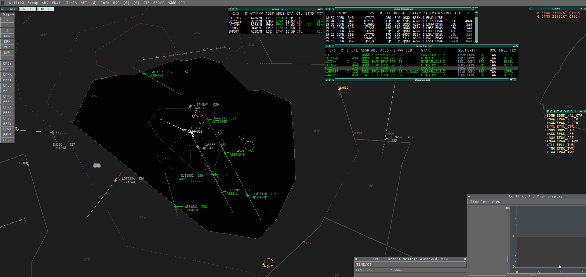
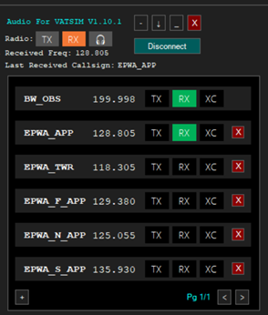

# Oprogramowanie

Podobnie jak w rzeczywistości, także w sieci VATSIM kluczową rolę w pracy kontrolerów odgrywa oprogramowanie. Połączyć się z siecią można jedynie przy użyciu jednego z [zaakceptowanych przez VATSIM](https://vatsim.net/docs/policy/approved-software) narzędzi. 

## EuroScope

Od kilku lat podstawowym narzędziem pracy kontrolerów Polish VACC, podobnie jak w większości innych europejskich subdywizji, jest [EuroScope](https://www.euroscope.hu/). Program ten pozwala symulować wszystkie przewidziane w sieci VATSIM pozycje kontrolerskie. Umożliwia też udostępnienie maksymalnie czterech informacji ATIS.

*EuroScope z załadowanym profilem Poland RADAR - widok Warszawa Approach (EPWA_APP przy jednocześnie zalogowanym EPWA_N_APP)*

Kolejną funkcją EuroScope jest obsługa symulowanych sesji szkoleniowych dzięki serwerom *SweatBox*, na których kontrolerzy mogą nabrać wprawy przed szkoleniem *online* lub przećwiczyć sytuacje rzadko spotykane w sieci.

Dzięki wtyczkom (pluginom) możliwe jest dostosowanie EuroScope do potrzeb danej subdywizji. W Polish VACC od 2025 zarówno zestaw wtyczek, jak i konfiguracja EuroScope są standaryzowane, co oznacza, że poszczególni kontrolerzy jedynie w minimalnym zakresie mogą modyfikować swoje instalacje. Ułatwia to współpracę między kontrolerami podczas wydarzeń (możliwość zastępowania się przy komputerach), a także rozwiązywanie problemów.

Ważnym elementem pracy z EuroScope jest plik z aktualną sektoryzacją (popularnie: sektor), czyli duży plik konfiguracyjny zawierający aktualne informacje o lotniskach, punktach i pomocach nawigacyjnych, a także procedurach. Jest on regularnie aktualizowany w ślad za zmianami publikowanymi w kolejnych cyklach AIRAC.

Polish VACC udostępnia wszystkim zainteresowanym aktualną konfigurację (profile wraz z instrukcją obsługi) oraz plik sektora.

## TrackAudio i AudioForVatsim

Obok oprogramowania umożliwiającego wyświetlanie i przesyłanie danych na temat samolotów, konieczne jest też narzędzie do komunikacji. Obecnie programem polecanym przez VATSIM jest [TrackAudio](https://github.com/pierr3/TrackAudio/releases/latest). Umożliwia podłączenie do sieci zarówno kontrolerom, jak i obserwatorom. Możliwe jest także monitorowanie kilku częstotliwości jednocześnie, a także konfigurowanie głośności każdej z nich oddzielnie.

import TrackAudio from './/assets/TrackAudio.png';

Popularnym dawniej, a obecnie używanym tylko wyjątkowo (choć nadal dopuszczalnym) programem do komunikacji jest [AudioForVatsim](https://audio.vatsim.net/docs/atc). Zapewnia on te same podstawowe funkcjonalności, jednak ma mniejsze możliwości konfiguracji.

## VACS

[VACS](https://vacs.network/) to program symulujący system komunikacji głosowej (*VCS* lub *Voice Communication System*) o interfejsie podobnym do systemów wykorzystywanych w rzeczywistości przez kontrolerów ruchu lotniczego. Choć jego używanie nie jest obowiązkowe, VACS jest lubianym przez część kontrolerów dodatkiem do standardowego zestawu EuroScope+TrackAudio. Jego podstawową funkcją jest [koordynacja z innymi kontrolerami](../air-traffic-management/air-traffic-management-coordination) - można "zadzwonić" do osoby obsługującej inną pozycję. Oprócz tego, dzięki integracji z TrackAudio oraz AudoForVatsim, możliwe jest między innymi odtworzenie poprzedniego odebranego komunikatu.

Zaletą (lub wadą, zależnie od gustu) VACS jest to, że w porównaniu do Discorda dobrze sprawdza się przy szybkiej i zwięzłej koordynacji, za to jest niemal bezużyteczny do prowadzenia nieformalnych rozmów towarzyskich.

import VACS from './/assets/VACS.png';

