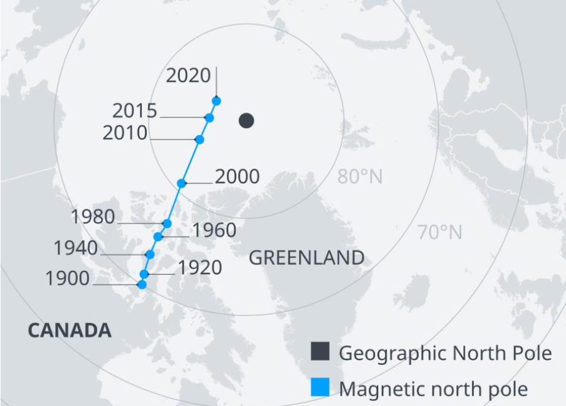
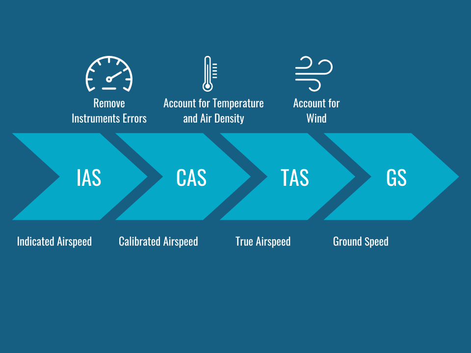
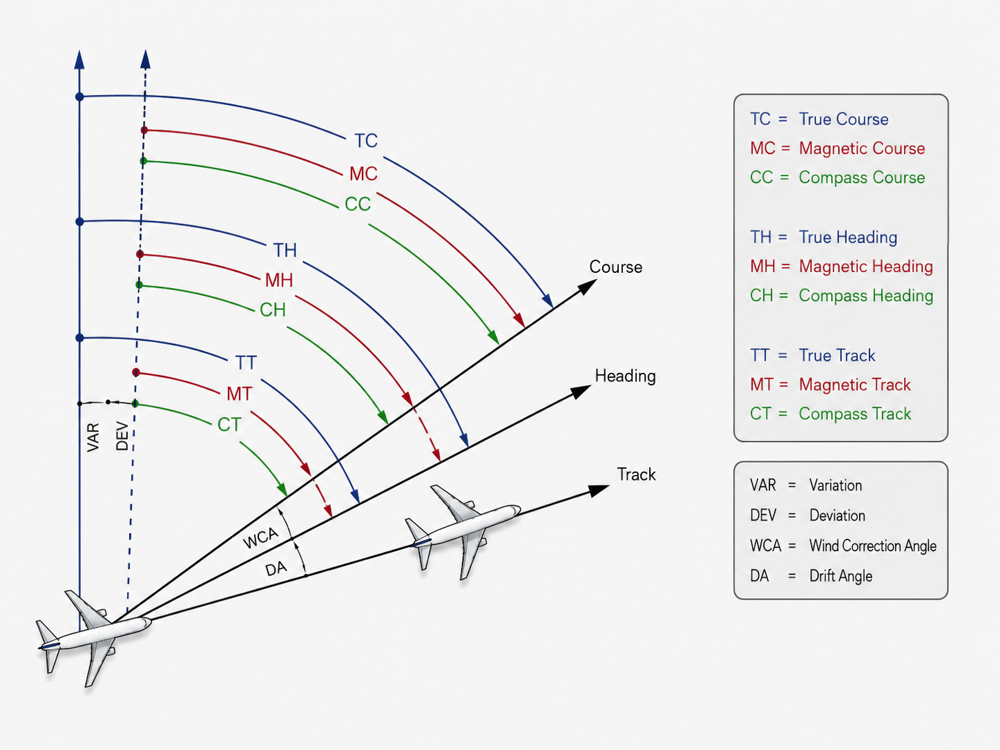
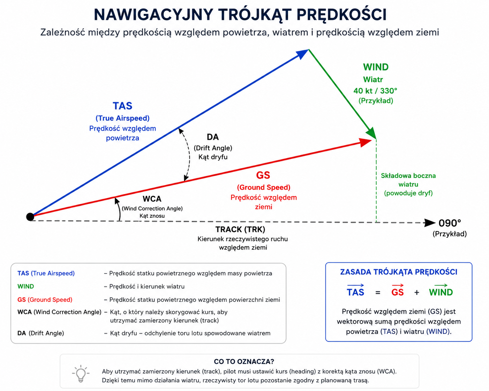
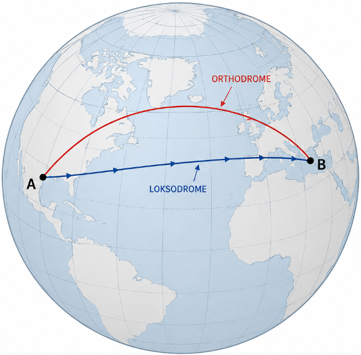

# Podstawy nawigacji lotniczej

## Kierunki i błędy

Aby jednoznacznie określić położenie oraz kierunek lotu statku powietrznego, w lotnictwie stosuje się kilka układów odniesienia. W zależności od rodzaju wykonywanej operacji kierunki mogą być odnoszone do północy geograficznej, magnetycznej lub wskazań kompasu pokładowego.

Z punktu widzenia kontrolera ruchu lotniczego najistotniejsze jest rozróżnienie pomiędzy kierunkami geograficznymi i magnetycznymi oraz zrozumienie wpływu deklinacji magnetycznej na publikowane procedury i oznaczenia dróg startowych.

### Kierunek geograficzny

**Kierunek geograficzny (True, T)** jest określany względem **północy geograficznej (True North)**, czyli kierunku wyznaczonego przez oś obrotu Ziemi i biegun północny.

Jest to podstawowy układ odniesienia wykorzystywany między innymi podczas planowania tras lotów dalekodystansowych, obliczeń nawigacyjnych oraz przedstawiania danych na mapach świata. W nawigacji lotniczej kierunki geograficzne oznacza się symbolem **T** (*True*).

Przykładowo, kurs geograficzny **090°T** oznacza lot dokładnie na wschód względem północy geograficznej.

### Kierunek magnetyczny

**Kierunek magnetyczny (Magnetic, M)** jest określany względem **północy magnetycznej (Magnetic North)**, wskazywanej przez pole magnetyczne Ziemi.

Ponieważ większość kompasów pokładowych reaguje na pole magnetyczne, kierunki magnetyczne są wykorzystywane podczas codziennej eksploatacji statków powietrznych. W większości państw świata również drogi startowe, procedury instrumentalne oraz instrukcje wydawane przez kontrolerów ruchu lotniczego odnoszą się właśnie do kierunków magnetycznych.

Przykładowo, polecenie:

> LOT123, turn right heading 270.

oznacza wykonanie zakrętu do **kursu magnetycznego 270°**, a nie geograficznego.

:::info
Wyjątek stanowią między innymi Kanada oraz część obszarów o wysokich szerokościach geograficznych, gdzie ze względu na specyfikę lokalnego pola magnetycznego stosowane są kierunki geograficzne.
:::

:::info
**CIEKAWOSTKA**
Biegun Magnetyczny Ziemi 'wędruje'. Choć dokładnej przyczyny takiej wędrówki nie są znane, to przypuszcza się, że są one związane z procesami zachodzącymi w jądrze Ziemii.
Dlatego właśnie, co jakiś czas należy wykonać korektę kursów opisanych na chartach. Prostym przykładem jest lotnisko w Katowicach (EPKT) - w październiku 2022 roku, oznaczenie drogi startowej z 09/27, zostało zmienione na 08/26 ze względu właśnie na zmianę kierunku pola magnetycznego Ziemii.

:::

### Deklinacja magnetyczna

**Deklinacja magnetyczna (Magnetic Variation/Declination)** jest kątem pomiędzy kierunkiem północy geograficznej a północy magnetycznej w danym miejscu na Ziemi.

Ponieważ biegun magnetyczny nie pokrywa się z biegunem geograficznym, wartości kierunków geograficznych i magnetycznych nie są identyczne. Wielkość deklinacji zależy od położenia geograficznego i zmienia się w czasie wskutek przemieszczania się biegunów magnetycznych.

Deklinację określa się jako:

- **wschodnią (East, E)** – gdy północ magnetyczna znajduje się na wschód od północy geograficznej,
- **zachodnią (West, W)** – gdy północ magnetyczna znajduje się na zachód od północy geograficznej.

Przykładowo, jeżeli w danym miejscu deklinacja wynosi **6°E**, oznacza to, że północ magnetyczna znajduje się 6° na wschód od północy geograficznej.

:::tip
Na mapach lotniczych wartość deklinacji magnetycznej jest podawana wraz z informacją o rocznej zmianie (*annual change*), co pozwala uwzględniać stopniowe przemieszczanie się biegunów magnetycznych.
:::

### Dewiacja

**Dewiacja (Deviation)** jest błędem wskazań kompasu magnetycznego spowodowanym lokalnym polem magnetycznym wytwarzanym przez elementy statku powietrznego, takie jak instalacja elektryczna, wyposażenie pokładowe czy konstrukcja kadłuba.

W przeciwieństwie do deklinacji magnetycznej, która zależy wyłącznie od położenia na Ziemi, dewiacja jest charakterystyczna dla konkretnego statku powietrznego i może różnić się w zależności od kierunku lotu.

W nowoczesnych statkach powietrznych wykorzystujących systemy AHRS (Attitude and Heading Reference System) oraz IRS (Inertial Reference System) znaczenie dewiacji jest znacznie mniejsze niż w przypadku klasycznych kompasów magnetycznych, jednak pojęcie to nadal pozostaje jedną z podstaw nawigacji lotniczej.

:::info
Z punktu widzenia kontrolera ruchu lotniczego dewiacja nie ma praktycznego znaczenia operacyjnego. Odpowiedzialność za uwzględnienie błędów wskazań kompasu spoczywa na pilocie oraz systemach pokładowych statku powietrznego.
:::

## Kursy i linie drogi

Podczas wykonywania lotu statek powietrzny może być opisywany za pomocą kilku różnych pojęć określających jego kierunek lub planowaną trasę. Choć w codziennym języku terminy takie jak *heading*, *track* czy *course* bywają używane zamiennie, w lotnictwie oznaczają one różne wielkości i nie powinny być ze sobą mylone.

Zrozumienie różnic pomiędzy tymi pojęciami jest szczególnie istotne podczas wektorowania, wykonywania procedur instrumentalnych oraz korzystania z pomocy radionawigacyjnych.

### Heading (HDG)

**Heading (HDG)** określa kierunek, w którym skierowany jest podłużna oś statku powietrznego, czyli jego nos. Innymi słowy jest to kurs, jaki pilot utrzymuje względem północy magnetycznej lub geograficznej.

Heading nie uwzględnia wpływu wiatru. Oznacza to, że nawet jeśli statek powietrzny utrzymuje stały heading, jego rzeczywista trajektoria lotu względem powierzchni Ziemi może być inna.

To właśnie **heading** jest parametrem wydawanym przez kontrolera podczas wektorowania.

Przykład:

> LOT123, turn right heading 270.

Pilot wykonuje zakręt i stabilizuje lot z nosem skierowanym na kurs **250°**. Jeżeli występuje wiatr boczny, rzeczywista linia lotu będzie różnić się od wydanego headingu.

### Track (TRK)

**Track (TRK)** określa rzeczywistą linię przemieszczania się statku powietrznego względem powierzchni Ziemi.

Na wartość tracku wpływa zarówno heading utrzymywany przez pilota, jak i oddziaływanie wiatru. W przypadku występowania bocznego wiatru track będzie różnił się od headingu o wartość znosu.

Przykładowo, jeżeli pilot utrzymuje heading **090°**, a wiatr znosi statek powietrzny na południe, rzeczywisty track może wynosić **085°**.

To właśnie track przedstawiany jest między innymi na mapach ruchomych oraz w systemach GNSS.

:::info
Przy braku wiatru **heading** oraz **track** są identyczne.
:::

### Course (CRS)

**Course (CRS)** oznacza zamierzoną linię drogi, którą statek powietrzny powinien podążać pomiędzy dwoma punktami.

Course nie opisuje aktualnego położenia nosa statku powietrznego, lecz wyznacza trasę, którą pilot zamierza utrzymać.

Przykładowo:

- oś lokalizera ILS wyznacza określony **course**,
- odcinek pomiędzy dwoma punktami RNAV posiada własny **course**,
- każda droga lotnicza publikowana na mapach ma przypisany course.

Pilot może utrzymywać heading różniący się od kursu, aby skompensować wpływ wiatru i pozostać na wyznaczonej trasie.

### Bearing (BRG)

**Bearing (BRG)** określa kierunek pomiędzy statkiem powietrznym a wybranym punktem nawigacyjnym lub innym obiektem.

W zależności od sposobu wyznaczenia może być podawany jako:

- **True Bearing (TB)** – względem północy geograficznej,
- **Magnetic Bearing (MB)** – względem północy magnetycznej,
- **Relative Bearing (RB)** – względem osi podłużnej statku powietrznego.

Bearing odpowiada na pytanie:

> **„W którym kierunku znajduje się dany punkt?”**

Przykładowo, jeżeli radiolatarnia znajduje się na bearingu **045°**, oznacza to, że znajduje się ona na kierunku 045° względem przyjętego układu odniesienia.

### Radial

**Radial** jest linią wychodzącą od radiolatarni **VOR** pod określonym kątem względem północy magnetycznej.

Każda radiolatarnia VOR posiada **360 radiali**, numerowanych od **001°** do **360°**. Numer radiala oznacza kierunek **od** stacji, a nie **do** niej.

Przykładowo:

- **Radial 090** prowadzi na wschód od radiolatarni,
- statek powietrzny lecący **do** stacji po radialu 090 będzie utrzymywał kurs zbliżony do **270°**.

Jest to jedno z najczęściej mylonych pojęć przez początkujących pilotów.

:::caution
Radial zawsze określa kierunek **od** radiolatarni VOR. Nie należy mylić go z bearingiem, który opisuje kierunek **do** lub **od** danego punktu, zależnie od przyjętego sposobu pomiaru.
:::

Wyróżniamy 2 kody Q, które określają to, czy SP wykonuje **DO** radiolatarnii VOR czy **OD** niej.
QDM - magnetyczny kierunek do radiostacji,
QDR - magnetyczny kierunek od radiostacji, odpowiadający radialowi VOR.

:::tip 
Jak można to łatwo zapamiętać? Bardzo prosto! 
QDM, możesz zapamiętać jako *"Kurs do mamy*" - czyli kierunek do stacji,
QDR będzie tym drugim - czyli radialem od stacji 
:::

## Wiatr a ruch statku powietrznego

Na ruch statku powietrznego względem powierzchni Ziemi wpływa nie tylko prędkość lotu, ale również wiatr. Powietrze, w którym porusza się statek powietrzny, samo przemieszcza się względem Ziemi, dlatego rzeczywista trajektoria oraz prędkość lotu mogą znacznie różnić się od wartości utrzymywanych przez pilota.

Dla kontrolera ruchu lotniczego zrozumienie wpływu wiatru jest istotne między innymi podczas wektorowania, przewidywania czasu dolotu do punktów nawigacyjnych oraz oceny odstępów pomiędzy statkami powietrznymi.

### Prędkość wskazywana (IAS)

**Prędkość wskazywana (Indicated Airspeed, IAS)** jest prędkością odczytywaną bezpośrednio ze wskaźnika prędkości (*airspeed indicator*). Wyznaczana jest na podstawie różnicy pomiędzy ciśnieniem całkowitym, mierzonego przez rurkę Pitota, a ciśnieniem statycznym.

Jest to podstawowa prędkość wykorzystywana przez pilotów podczas wykonywania lotu. Większość ograniczeń eksploatacyjnych statku powietrznego, takich jak prędkości wypuszczenia klap, podwozia czy prędkości podejścia, odnosi się właśnie do IAS.

Wraz ze wzrostem wysokości gęstość powietrza maleje, dlatego przy tej samej wartości IAS rzeczywista prędkość lotu względem masy powietrza będzie coraz większa.

:::info
To właśnie **IAS** jest prędkością, którą pilot utrzymuje podczas lotu oraz którą najczęściej podaje w instrukcjach operacyjnych producent statku powietrznego.
:::

### Prędkość kalibrowana (CAS)

**Prędkość kalibrowana (Calibrated Airspeed, CAS)** jest prędkością wskazywaną (**IAS**) skorygowaną o błędy wynikające z niedokładności instalacji pitot-static oraz błędów samego przyrządu.

W większości faz lotu różnica pomiędzy IAS i CAS jest niewielka i wynosi zazwyczaj od ułamków do kilku węzłów. W nowoczesnych statkach powietrznych obliczenie tej poprawki odbywa się automatycznie przez systemy pokładowe.

CAS stanowi wartość pośrednią wykorzystywaną do wyznaczenia rzeczywistej prędkości względem powietrza (**TAS**).

:::tip
W codziennej pracy kontrolera rozróżnienie pomiędzy IAS i CAS nie ma praktycznego znaczenia. Warto jednak znać zależność pomiędzy tymi wielkościami, ponieważ często pojawiają się one w literaturze lotniczej oraz materiałach szkoleniowych.
:::

### Prędkość względem powietrza (TAS)

**Prędkość względem powietrza (True Airspeed, TAS)** jest rzeczywistą prędkością statku powietrznego względem otaczającej go masy powietrza.

Można ją wyobrazić sobie jako prędkość, z jaką statek powietrzny poruszałby się w całkowicie nieruchomej atmosferze.

Na wartość TAS wpływa między innymi wysokość lotu oraz temperatura powietrza. Wraz ze wzrostem wysokości, przy zachowaniu tej samej prędkości wskazywanej (**IAS**), wartość TAS również rośnie.

:::info
Pilot steruje statkiem powietrznym względem masy powietrza, a nie względem powierzchni Ziemi. To właśnie dlatego wiatr ma bezpośredni wpływ na rzeczywistą trajektorię lotu.
:::

### Prędkość względem ziemi (GS)

**Prędkość względem ziemi (Ground Speed, GS)** określa prędkość przemieszczania się statku powietrznego względem powierzchni Ziemi.

Jest to wartość obserwowana między innymi przez odbiorniki GNSS oraz wykorzystywana do obliczania przewidywanego czasu przelotu (*Estimated Time En Route, ETE*).

W przeciwieństwie do TAS, na wartość GS bezpośredni wpływ ma wiatr:

- **wiatr czołowy (headwind)** zmniejsza GS,
- **wiatr tylny (tailwind)** zwiększa GS,
- **wiatr boczny (crosswind)** wpływa przede wszystkim na kierunek lotu, a jego wpływ na GS jest zazwyczaj niewielki.

Przykład:

- **TAS = 450 kt**
- **wiatr czołowy = 50 kt**

Prędkość względem ziemi wyniesie w przybliżeniu **GS ≈ 400 kt**

Natomiast przy **wietrze tylnym** o tej samej prędkości **GS ≈ 500 kt**

:::tip
Poniżej możesz zobaczyć graficznie różnice tych prędkości

Źródło: https://jetplaneczx.medium.com/the-5-airspeeds-whats-the-difference-af84887dd1e5

### Dryf

**Dryf (Drift)** jest odchyleniem rzeczywistej trajektorii lotu od zamierzonej linii drogi, spowodowanym działaniem wiatru bocznego.

Jeżeli pilot nie skompensuje wpływu wiatru, statek powietrzny będzie stopniowo znoszony z planowanej trasy.

Przykładowo, podczas lotu na wschód silny wiatr z północy będzie powodował stopniowe znoszenie statku powietrznego na południe.

Im większa prędkość wiatru względem prędkości lotu, tym większy będzie dryf.

### Kąt znosu

Aby przeciwdziałać dryfowi, pilot wykonuje **korektę kursu**, zwaną **kątem znosu (Wind Correction Angle, WCA)**.

Polega ona na ustawieniu nosa statku powietrznego pod niewielkim kątem względem planowanej linii drogi, tak aby wpływ wiatru został zrównoważony.

Dzięki temu:

- **heading** będzie różnił się od **course**,
- natomiast **track** pozostanie zgodny z zaplanowaną trasą.

Przykładowo, jeżeli wiatr znosi statek powietrzny na południe, pilot może utrzymywać heading **095°**, aby rzeczywisty track wynosił **090°**.

:::tip
To właśnie dlatego pilot lecący idealnie po osi lokalizera bardzo często nie ma nosa statku powietrznego skierowanego dokładnie wzdłuż pasa startowego. W zależności od kierunku i siły wiatru konieczne jest zastosowanie odpowiedniego kąta znosu.
:::

## Zależności pomiędzy różnymi kierunkami i kursami - podsumowanie

Powyższe pojęcia są ze sobą ściśle powiązane. W praktyce podczas lotu jednocześnie występują zależności pomiędzy kierunkiem geograficznym, magnetycznym i kompasowym, a także pomiędzy kursem, linią drogi oraz wpływem wiatru na tor lotu statku powietrznego.

Poniższy schemat przedstawia graficznie zależności pomiędzy wszystkimi omówionymi wcześniej wielkościami.

## Nawigacyjny trójkąt prędkości

Nawigacyjny trójkąt prędkości (*Navigation Triangle of Velocities*) przedstawia zależność pomiędzy prędkością statku powietrznego względem masy powietrza (**TAS**), prędkością wiatru oraz rzeczywistą prędkością statku powietrznego względem powierzchni Ziemi (**GS**).

Z matematycznego punktu widzenia jest to **suma wektorów prędkości**:

- wektora prędkości statku powietrznego względem powietrza (**TAS**),
- wektora prędkości i kierunku wiatru,
- wynikowego wektora prędkości względem ziemi (**GS**).

To właśnie na podstawie tych zależności pilot może określić:

- rzeczywistą prędkość względem ziemi,
- przewidywany czas dolotu do punktu nawigacyjnego,
- wartość dryfu wywołanego przez wiatr,
- wymagany **kąt znosu (Wind Correction Angle, WCA)**.

Przykładowy schemat nawigacyjnego trójkąta prędkości:

Przykładowo, jeżeli statek powietrzny wykonuje lot z **TAS 250 kt**, a wiatr wieje z lewej strony z prędkością **40 kt**, pilot musi odpowiednio skorygować heading, aby utrzymać zaplanowany track. Jednocześnie zmieni się również prędkość względem ziemi (**GS**), od której zależy między innymi przewidywany czas przelotu.

W nowoczesnych statkach powietrznych wszystkie obliczenia wykonywane są automatycznie przez systemy zarządzania lotem (**FMS – Flight Management System**) oraz odbiorniki **GNSS**. Zrozumienie zależności pomiędzy poszczególnymi wektorami pozostaje jednak podstawą nawigacji lotniczej.

## Ortodroma i loksodroma

Podczas planowania trasy lotu pomiędzy dwoma punktami na powierzchni Ziemi można wyróżnić dwa podstawowe rodzaje linii: **ortodromę** oraz **loksodromę**.

### Ortodroma

**Ortodroma (Great Circle)** jest najkrótszą drogą pomiędzy dwoma punktami na powierzchni kuli ziemskiej.

Jej charakterystyczną cechą jest to, że przecina kolejne południki pod zmieniającym się kątem. Oznacza to, że podczas lotu po ortodromie pilot nie utrzymuje jednego, stałego kursu, lecz stopniowo go zmienia.

Na krótkich odległościach różnica pomiędzy ortodromą i loksodromą jest praktycznie niezauważalna. W przypadku lotów międzykontynentalnych może jednak wynosić nawet kilkaset kilometrów, dlatego nowoczesne systemy planowania lotu wykorzystują właśnie ortodromę jako podstawę wyznaczania trasy.

### Loksodroma

**Loksodroma (Rhumb Line)** jest linią przecinającą wszystkie południki pod jednakowym kątem.

Jej największą zaletą jest możliwość utrzymywania stałego kursu przez cały lot. Z tego względu była powszechnie wykorzystywana w czasach, gdy nawigacja opierała się głównie na kompasie magnetycznym oraz mapach papierowych.

W przeciwieństwie do ortodromy loksodroma niemal zawsze jest dłuższa, a różnica długości rośnie wraz z odległością pomiędzy punktami.

:::tip
Na mapach typu Mercatora loksodroma przedstawiana jest jako linia prosta, natomiast ortodroma ma postać łuku. Z kolei na powierzchni Ziemi to właśnie ortodroma stanowi najkrótszą możliwą trasę pomiędzy dwoma punktami.
:::

Źródło: [Hrvatska Enciklopedija](https://enciklopedija.hr/clanak/ortodroma)

## Znaczenie dla kontrolera

Choć kontroler ruchu lotniczego nie wykonuje obliczeń nawigacyjnych za pilota, znajomość podstaw nawigacji pozwala lepiej rozumieć zachowanie statków powietrznych oraz przewidywać przebieg wykonywanych operacji.

W codziennej pracy wykorzystujesz tę wiedzę między innymi podczas:

- wydawania **headingów** w trakcie wektorowania;
- przewidywania wpływu wiatru na rzeczywistą trajektorię lotu oraz prędkość względem ziemi;
- oceny czasu dolotu statku powietrznego do punktów nawigacyjnych;
- prowadzenia statków powietrznych do procedur instrumentalnych oraz przechwycenia osi podejścia końcowego;
- interpretowania procedur opartych o radiolatarnie **VOR**, lokalizery **ILS** oraz procedury **RNAV**;
- analizowania sytuacji radarowej, na której obserwowany **track** statku powietrznego może różnić się od wydanego przez kontrolera **headingu**;
- planowania sekwencji podejść i odlotów z uwzględnieniem wpływu warunków meteorologicznych.

Znajomość pojęć takich jak **heading**, **track**, **course**, **bearing**, **radial**, **TAS**, **GS**, **dryf** czy **kąt znosu** pozwala nie tylko poprawnie interpretować informacje przekazywane przez pilotów, ale również zrozumieć przyczyny ich działań oraz ograniczenia wynikające z warunków atmosferycznych.
