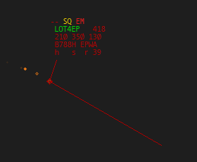
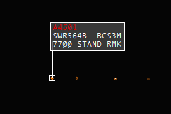
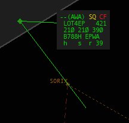
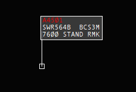
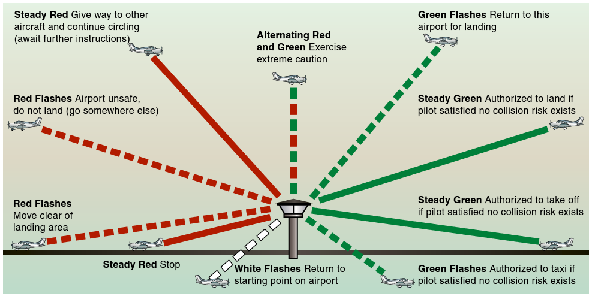

# Sytuacje szczególne i niebezpieczne

Sytuacje szczególne i niebezpieczne to zdarzenia, które wymagają od załogi statku powietrznego oraz służb ruchu lotniczego podjęcia dodatkowych działań w celu zapewnienia bezpieczeństwa lotu.

W zależności od stopnia zagrożenia sytuacje te mogą wymagać jedynie zwiększonej uwagi ze strony kontrolera lub natychmiastowej reakcji wszystkich zaangażowanych służb.

## Sytuacje awaryjne a VATSIM

Zgodnie z **[VATSIM Code Of Conduct B6](https://vatsim.net/docs/policy/code-of-conduct)**, żadna załoga nie może samodzielnie nadawać sobie pierwszeństwa nad innymi operacjami. To Ty jako kontroler masz możliwość nadania takiego pierwszeństwa, ale masz również możliwość odmowy prowadzenia takiej sytuacji.

Na ogół dozwolone jest, aby piloci zgłaszali sytuacje awaryjne podczas lotu **tylko wtedy, gdy znajdują się pod kontrolą**.

Ty jako kontroler możesz natomiast z dowolnego powodu **odmówić** przyjęcia awaryjnej operacji oraz **nakazać zakończenie sytuacji awaryjnej** lub **rozłączenie się pilota z sieci**. W takiej sytuacji pilot zobowiązany jest do wykonania takiego polecenia **natychmiast**.

Jeżeli pilot nie wykonuje Twojego polecenia, rozłączenia się czy przerwania sytuacji niebezpiecznej, masz całkowite prawo do wysłania zgłoszenia do Supervisora. [.wallop] gdy jesteś zalogowany, lub [otwierając ticket na VATSIM Support](https://support.vatsim.net/open.php).

_*"If, for any reason, air traffic control requests the pilot to terminate the emergency, then the pilot shall do so IMMEDIATELY or disconnect from the network."*_ - Code of Conduct B6

<u>**Zabrania się**</u> symulowania sytuacji bezprawnej ingerencji (*hijack*) w jakikolwiek sposób.

## Szczególne kody transpondera

Wyróżniamy **3 szczególne kody transpondera**, które natychmiast zwracają uwagę kontrolerów.

| SQUAWK | CO OZNACZA |
| :---: | :--- |
| 7500 | Bezprawna ingerencja **ZABRONIONE NA VATSIM** |
| 7600 | Utrata łączności |
| 7700 | Sytuacja niebezpieczna |

W przypadku ustawienia przez pilota kodu **7500** zostanie on po kilku sekundach rozłączony z sieci oraz poniesie on konsekwencje.

:::info 
TAG samolotu w zależności od ustawionego specjalnego kodu transpondera, odpowiednio wyświetla się na wskaźniku radarowym.
W przypadku sytuacji niebezpiecznej (7700)

W przypadku utraty łączności (7600)

:::

## Sytuacja niebezpieczeństwa (MAYDAY)

Zgodnie z **ICAO Doc 9432 - Podręcznik radiotelefonicznej służby ruchu lotniczego**, depesze MAYDAY stosuje się w przypadku wystąpienia sytuacji niebezpieczeństwa, czyli takiej, w której istnieje zagrożenie poważnym i/lub bliskim niebezpieczeństwem i konieczne jest udzielenie natychmiastowej pomocy.

:::caution
Depesze o niebezpieczeństwie (MAYDAY) posiadają pierwszeństwo w kolejności nadawania wobec wszystkich komunikatów.
:::

Do przykładowych sytuacji wymagających zgłoszenia MAYDAY należą:

- pożar lub zadymienie na pokładzie,
- poważna awaria silnika,
- uszkodzenie konstrukcji statku powietrznego,
- utrata kontroli nad samolotem,
- sytuacja wymagająca natychmiastowego lądowania.

:::info
Nie każda awaria oznacza sytuację MAYDAY. Ostateczna decyzja o użyciu tego zgłoszenia należy do dowódcy statku powietrznego, który ocenia stopień zagrożenia oraz dostępny czas na rozwiązanie problemu.
:::

### Zgłoszenie MAYDAY przez pilota

Pilot rozpoczyna komunikat od trzykrotnego powtórzenia słowa **MAYDAY**.

W zależności od możliwości i czasu dostępnego załodze komunikat powinien zawierać:

- nazwę stacji, do której depesza jest adresowana,
- identyfikację statku powietrznego,
- rodzaj sytuacji niebezpiecznej,
- zamiar dowódcy statku powietrznego,
- aktualną pozycję, wysokość (tj. poziom lotu, wysokość bezwzględną itd., stosownie do sytuacji) oraz kurs,
- dodatkowe informacje istotne dla dalszych działań.

**Przykład:**

> **PILOT:** MAYDAY MAYDAY MAYDAY, KRAKÓW WIEŻA, SP-ABC, POŻAR SILNIKA, PRÓBUJĘ WYLĄDOWAĆ NA TWOIM LOTNISKU, POZYCJA 3 MILE NA POŁUDNIE OD BALIC, ALTITUDE 2000 STÓP KURS 360.  
> **ATC:** SP-ABC KRAKÓW WIEŻA PRZYJĄŁEM MAYDAY, PAS 25 ZEZWALAM LĄDOWAĆ, WIATR 260 STOPNI 10 WĘZŁÓW QNH 1013.  
> **PILOT:** PAS 25 ZEZWALASZ LĄDOWAĆ QNH 1013, SP-ABC

:::tip ASSIST, czyli pierwsze działania kontrolera

Dobrym sposobem zapamiętania kolejności działań po odebraniu zgłoszenia **MAYDAY** jest zasada **ASSIST**, lub zmienioną wersję na potrzeby VATSIM zasada **ASSISTED**.

- **Acknowledge** - potwierdź odebranie zgłoszenia i upewnij pilota, że jego sytuacja została zrozumiana.
- **Separate** - zapewnij separację od pozostałego ruchu oraz pozostaw załodze wystarczająco dużo przestrzeni do wykonywania manewrów.
- **Silence** - ogranicz korespondencję na częstotliwości. Jeżeli jest to możliwe, przenieś ruch na inną częstotliwość lub nakaż pozostałym statkom powietrznym zachowanie **ciszy radiowej**.
- **Inform** - poinformuj odpowiednie organy ATS oraz służby, które mogą udzielić pomocy. W razie potrzeby przekaż również informacje innym zainteresowanym podmiotom.
- **Support** - wspieraj załogę we wszystkich możliwych działaniach. Rozważ alternatywne lotniska, odpowiednią drogę dolotu, wektorowanie lub inne rozwiązania, które mogą ułatwić bezpieczne zakończenie lotu.
- **Time** - daj załodze czas. Nie zasypuj pilota pytaniami, gdy wykonuje listy kontrolne lub rozwiązuje problem. Dobrze podjęte decyzje wymagają czasu.
===
- **Else, Disconnect** jeżeli sytuacja niebezpieczeństwa przerasta Ciebie, na przykład ze względu na Twój workload i nie jesteś w stanie zapewnić bezpiecznego prowadzenia kontroli ruchu lotniczego, bądź wpłynęło by to na jakość kontroli, jak wcześniej wspomniane masz prawo nakazać rozłączenia się pilotowi.

Pamiętaj, że najważniejszym zadaniem kontrolera jest **odciążenie załogi**, a nie zwiększanie jej obciążenia dodatkowymi pytaniami czy instrukcjami.
:::

Jeżeli sytuacja na to pozwala, należy zapytać pilota o:

- liczbę osób na pokładzie,
- ilość pozostałego paliwa,
- posiadanie niebezpiecznych materiałów na pokładzie statku powietrznego (*dangerous goods*).

> **ATC:** SP-ABC MAYDAY Kraków Wieża  
> **PILOT:** Kraków Wieża SP-ABC MAYDAY  
> **ATC:** SP-ABC MAYDAY, kiedy gotowy zgłoś osoby na pokładzie, pozostałe paliwo oraz czy posiadasz materiały niebezpieczne.

:::tip
Nie wiemy, co pilot aktualnie robi. Czy wykonuje checklistę, przygotowuje się do lądowania, przeprowadza briefing, czy może próbuje zebrać myśli. Z tego powodu zaleca się najpierw wywołanie załogi, a dopiero potem przekazywanie instrukcji lub ustalanie szczegółów.
:::

Pilot, gdy będzie gotowy, poda potrzebne informacje. Pamiętaj - ty musisz je powtórzyć. Są one szczególnie istotne dla służb ratunkowych.

Jeżeli jest na to wystarczająco dużo czasu, możemy wydać załodze instrukcję ustawienia kodu **7700**.

> **ATC:** SP-ABC SQUAWK MAYDAY.

## Sytuacja nagląca (PAN PAN)

Zgodnie z **ICAO Doc 9432 - Podręcznik radiotelefonicznej służby ruchu lotniczego**, depesze PAN PAN stosuje się w przypadku wystąpienia sytuacji naglącej, czyli takiej, w której konieczne jest zapewnienie bezpieczeństwa statkowi powietrznemu, osobie znajdującej się na pokładzie lub osobie będącej w zasięgu widzenia, lecz sytuacja ta nie wymaga udzielenia natychmiastowej pomocy.

:::caution
Depesze zawierające sygnał naglący (PAN PAN) posiadają pierwszeństwo w kolejności nadawania wobec wszystkich komunikatów z wyjątkiem depesz o niebezpieczeństwie (MAYDAY).
:::

### Zgłoszenie PAN PAN przez pilota

Pilot rozpoczyna komunikat od trzykrotnego powtórzenia słowa **PAN PAN**.

W zależności od możliwości i czasu dostępnego załodze komunikat powinien zawierać:

- nazwę stacji, do której depesza jest adresowana,
- identyfikację statku powietrznego,
- rodzaj sytuacji naglącej,
- zamiar dowódcy statku powietrznego,
- aktualną pozycję, wysokość (tj. poziom lotu, wysokość bezwzględną itd., stosownie do sytuacji) oraz kurs,
- dodatkowe informacje istotne dla dalszych działań.

**Przykład:**

> **PILOT:** PAN PAN, PAN PAN, PAN PAN, KRAKÓW WIEŻA, SP-ABC, 3 MILE NA PÓŁNOC, ALTITUDE 2000 STÓP. PASAŻER Z PODEJRZENIEM ATAKU SERCA. PROSZĘ O PIERWSZEŃSTWO DO LĄDOWANIA.  
> **ATC:** SP-ABC KRAKÓW WIEŻA NUMER 1, PAS 25 ZEZWALAM LĄDOWAĆ, WIATR 260 STOPNI 10 WĘZŁÓW QNH 1013, POGOTOWIE POWIADOMIONE.  
> **PILOT:** PAS 25 ZEZWALASZ LĄDOWAĆ QNH 1013, SP-ABC

Jeżeli sytuacja na to pozwala, należy zapytać pilota o:

- liczbę osób na pokładzie,
- ilość pozostałego paliwa,
- posiadanie niebezpiecznych materiałów na pokładzie statku powietrznego (*dangerous goods*).

> **ATC:** SP-ABC Kraków Wieża  
> **PILOT:** Kraków Wieża SP-ABC  
> **ATC:** KRAKÓW WIEŻA, SP-ABC, kiedy gotowy zgłoś osoby na pokładzie, pozostałe paliwo oraz czy posiadasz materiały niebezpieczne.

:::tip
Nie wiemy, co pilot aktualnie robi. Czy wykonuje checklistę, przygotowuje się do lądowania, przeprowadza briefing, czy może próbuje zebrać myśli. Z tego powodu zaleca się najpierw wywołanie załogi, a dopiero potem przekazywanie instrukcji lub ustalanie szczegółów.
:::

Pilot, gdy będzie gotowy, poda potrzebne informacje. Pamiętaj - ty musisz je powtórzyć. Są one szczególnie istotne dla służb ratunkowych.

---

## Cisza radiowa

W przypadku sytuacji niebezpieczeństwa stacja znajdująca się w niebezpieczeństwie lub stacja kierująca wymianą korespondencji dotyczącej niebezpieczeństwa może nakazać innym stacjom zachowanie ciszy radiowej w celu zapewnienia sprawnej wymiany informacji.

Do tego celu stosuje się polecenie **PRZERWIJ NADAWANIE (STOP TRANSMITTING)**.

Polecenie to może zostać skierowane do wszystkich stacji danego obszaru lub tylko do konkretnej stacji zakłócającej wymianę korespondencji dotyczącej niebezpieczeństwa.

**Przykład:**

> **ATC:** DO WSZYSTKICH STACJI, KRAKÓW WIEŻA, PRZERWIJ NADAWANIE. MAYDAY.

Odwołanie ciszy radiowej może odbyć się, gdy stacja znajdująca się w niebezpieczeństwie poinformuje zainteresowany organ służby ruchu lotniczego o zakończeniu sytuacji niebezpiecznej.

W tym celu załoga, która wcześniej zgłaszała sytuację niebezpieczną, powinna nadać depeszę:

**ODWOŁUJĘ STAN NIEBEZPIECZEŃSTWA**

na częstotliwości lub częstotliwościach, na których odbywała się wymiana korespondencji.

**Przykład:**

> **PILOT:** KRAKÓW WIEŻA SP-ABC ODWOŁUJĘ STAN NIEBEZPIECZEŃSTWA, SILNIK SPRAWNY, WIDZĘ PAS. PROSZĘ O LĄDOWANIE.  
> **ATC:** SP-ABC WIATR 260 STOPNI 10 WĘZŁÓW, PAS 25 ZEZWALAM LĄDOWAĆ.  
> **PILOT:** PAS 25 ZEZWALASZ LĄDOWAĆ SP-ABC  
> **ATC:** DO WSZYSTKICH STACJI KRAKÓW WIEŻA, ODWOŁUJĘ STAN NIEBEZPIECZEŃSTWA.

## Utrata łączności

Jeżeli załoga statku powietrznego nie może nawiązać łączności z personelem ATS na określonej częstotliwości, zobowiązana jest do sprawdzenia łączności na następnej częstotliwości przewidzianej dla danej trasy.

Jeżeli ta próba również nie powiedzie się, należy próbować wywołać załogę innego statku powietrznego lub kolejną służbę ruchu lotniczego znajdującą się na trasie lotu.

Jeżeli wszystkie próby nawiązania łączności zakończą się niepowodzeniem, załoga powinna dwukrotnie nadać swoją depeszę na częstotliwości, na której się znajdowała, rozpoczynając ją zwrotem: **NADAJĘ NA ŚLEPO**

Jeżeli statek powietrzny nie jest w stanie nawiązać łączności z powodu awarii sprzętu radiowego, powinien w miarę możliwości zasygnalizować utratę łączności poprzez ustawienie kodu transpondera **7600**.

Jeżeli statek powietrzny znajduje się w rejonie lotniska kontrolowanego, wieża kontroli lotów będzie kierować instrukcjami za pomocą sygnałów świetlnych.

| **KOLOR I RODZAJ** | **NA ZIEMI** | **W POWIETRZU** |
| :---: | :---: | :---: |
| CIĄGŁE ZIELONE | ZEZWALA SIĘ STARTOWAĆ | ZEZWALA SIĘ LĄDOWAĆ |
| MIGAJĄCE ZIELONE | ZEZWALA SIĘ KOŁOWAĆ | WRACAĆ DO LĄDOWANIA* |
| CIĄGŁE CZERWONE | ZATRZYMAĆ SIĘ | DAĆ PIERWSZEŃSTWO DROGI INNYM SP I KONTYUNOWAĆ KRĄŻENIE |
| MIGAJĄCE CZERWONE | KOŁOWAĆ POZA POLEM WZLOTÓW | LOTNISKO NIE JEST BEZPIECZNE, NIE LĄDOWAĆ |
| MIGAJĄCE BIAŁE | WRACAĆ DO PUNKTU WYJŚCIOWEGO NA LOTNISKU | LĄDOWAĆ NA TYM LOTNISKU I KOŁOWAĆ DO PŁYTY POSTOJOWEJ* |
| NAPRZEMIENNE CZERWONE/ZIELONE | ZACHOWAJ SZCZEGÓLNĄ OSTROŻNOŚĆ | ZACHOWAJ SZCZEGÓLNĄ OSTROŻNOŚĆ |

-> * Zezwolenia na lądowanie i kołowanie będą podane w odpowiednim czasie

*Żródło: [CFI Brief: ATC Tower Light Gun Signals](https://learntoflyblog.com/cfi-brief-atc-tower-light-gun-signals/)*

Dokładne procedury lotniskowe na wypadek utraty łączności znajdują się w [**AIP**](https://www.ais.pansa.pl/publikacje/aip-polska/) danego lotniska.

Przykładowo dla lotniska **EPWA** będzie to:

- **AD 2 EPWA → EPWA 1 → 5.5 UTRATA ŁĄCZNOŚCI W LOCIE VFR**
- **AD 2 EPWA → EPWA 1 → 4.1 PROCEDURA UTRATY ŁĄCZNOŚCI DLA LOTÓW IFR**

---

## Częstotliwość GUARD

Częstotliwość **121,500 MHz**, znana jako **Guard**, jest międzynarodową częstotliwością alarmową przeznaczoną do wykorzystania w sytuacjach niebezpieczeństwa oraz w celu nawiązania kontaktu ze statkiem powietrznym, gdy standardowe środki łączności są niedostępne.

Jest ona wykorzystywana przede wszystkim w sytuacjach wymagających pomocy, takich jak utrata łączności, sytuacja awaryjna na pokładzie lub konieczność przekazania ważnych informacji dotyczących bezpieczeństwa lotu.

Zgodnie z **ICAO Annex 10 - Aeronautical Telecommunications** częstotliwość 121,500 MHz jest przeznaczona do celów alarmowych.

---

### Monitorowanie częstotliwości Guard

Piloci oraz kontrolerzy ruchu lotniczego powinni, jeżeli jest to możliwe, monitorować częstotliwość **121,500 MHz** w celu umożliwienia szybkiej reakcji na sytuacje awaryjne.

W przypadku odebrania transmisji alarmowej na częstotliwości Guard należy:

- nie zakłócać prowadzonej korespondencji,
- umożliwić wymianę informacji pomiędzy statkiem powietrznym a służbami ATS,
- w razie potrzeby pomóc w przekazaniu informacji właściwemu organowi.

---

### Wykorzystanie Guard na VATSIM

Zgodnie z **[VATSIM Code of Conduct (A16)](https://vatsim.net/docs/policy/code-of-conduct)** wszystkie częstotliwości głosowe oraz tekstowe służą wyłącznie do celów operacyjnych.

Częstotliwość alarmowa **121,500 MHz** może być wykorzystywana wyłącznie zgodnie z rzeczywistymi procedurami. Piloci oraz kontrolerzy powinni monitorować ją, jeżeli mają taką możliwość.

Nie należy wykorzystywać częstotliwości Guard do:

- prywatnych rozmów,
- testowania radia,
- żartów lub nieoperacyjnej korespondencji.

:::caution
Częstotliwość Guard jest przeznaczona wyłącznie do komunikacji związanej z bezpieczeństwem lotu. Nieuzasadnione nadawanie na 121,500 MHz może utrudnić przekazanie rzeczywistego zgłoszenia awaryjnego.
:::

---

## Służba alarmowa

Służba alarmowa (*Alerting Service*) jest jedną ze służb zapewnianych przez służby ruchu lotniczego (ATS). Jej zadaniem jest powiadamianie odpowiednich służb ratowniczych oraz wspieranie działań mających na celu udzielenie pomocy statkom powietrznym znajdującym się w sytuacji wymagającej interwencji.

:::caution 
Zgodnie z [Operations Manual vFIR Warszawa (INOP) 8.2 - Alert Serivce](https://cv.plvacc.pl/storage/app/public/documents/LEXOwPWErxBUuafeiyNadFpm2dWazjOimSiJiWoP.pdf), służba alarmowa nie jest symulowana na VATSIM.
:::

Zgodnie z **ICAO Annex 11 - Air Traffic Services** wyróżnia się trzy podstawowe fazy alarmowe:

- **INCERFA** (*Uncertainty Phase*) - faza niepewności,
- **ALERFA** (*Alert Phase*) - faza alarmu,
- **DETRESFA** (*Distress Phase*) - faza niebezpieczeństwa.

Przejście pomiędzy poszczególnymi fazami zależy od dostępnych informacji dotyczących sytuacji statku powietrznego oraz stopnia zagrożenia.

### Faza niepewności (INCERFA)

**INCERFA** (*Uncertainty Phase*) jest pierwszą fazą alarmową, stosowaną gdy pojawia się niepewność co do bezpieczeństwa statku powietrznego lub osób znajdujących się na jego pokładzie.

Może zostać rozpoczęta między innymi w przypadku:

- braku oczekiwanego raportu pozycyjnego lub meldunku,
- braku możliwości nawiązania łączności ze statkiem powietrznym,
- braku informacji o dalszym przebiegu lotu.

Na tym etapie nie ma jeszcze potwierdzenia, że statek powietrzny znajduje się w niebezpieczeństwie, jednak sytuacja wymaga zwiększonej uwagi oraz monitorowania.

### Faza alarmu (ALERFA)

**ALERFA** (*Alert Phase*) jest stosowana, gdy istnieją uzasadnione obawy dotyczące bezpieczeństwa statku powietrznego, jednak nie ma jeszcze pewności, że znajduje się on w sytuacji wymagającej natychmiastowej pomocy.

Może zostać ogłoszona między innymi gdy:

- po fazie INCERFA dalsze próby kontaktu ze statkiem powietrznym nie przynoszą rezultatu,
- informacje otrzymane od załogi wskazują na możliwe problemy,
- statek powietrzny zgłosił sytuację wymagającą zwiększonej gotowości służb ratowniczych.

W tej fazie odpowiednie służby mogą zostać postawione w stan gotowości.

### Faza niebezpieczeństwa (DETRESFA)

**DETRESFA** (*Distress Phase*) jest najwyższą fazą alarmową i oznacza, że istnieje uzasadnione przekonanie, iż statek powietrzny oraz osoby na jego pokładzie znajdują się w poważnym i bezpośrednim niebezpieczeństwie oraz wymagają natychmiastowej pomocy.

Może zostać ogłoszona między innymi w przypadku:

- otrzymania zgłoszenia MAYDAY,
- potwierdzonej awarii uniemożliwiającej bezpieczne kontynuowanie lotu,
- braku kontaktu ze statkiem powietrznym, gdy istnieją przesłanki wskazujące na zagrożenie.

W fazie DETRESFA mogą zostać uruchomione procedury poszukiwawczo-ratownicze.

:::info
Fazy alarmowe nie zawsze muszą występować kolejno. W przypadku jednoznacznego zagrożenia, np. odebrania zgłoszenia MAYDAY, służby ATS mogą przejść bezpośrednio do fazy DETRESFA.
:::

## Rola kontrolera ruchu lotniczego

W przypadku wystąpienia sytuacji wymagającej zastosowania służby alarmowej Twoim zadaniem jako kontrolera jest:

- zebranie dostępnych informacji dotyczących statku powietrznego,
- utrzymanie kontaktu, jeżeli jest to możliwe,
- przekazanie informacji odpowiednim organom ATS,
- zapewnienie pierwszeństwa oraz pomocy statkowi powietrznemu znajdującemu się w niebezpieczeństwie.

Kontroler nie prowadzi samodzielnie działań ratowniczych, ale pełni kluczową rolę w przekazywaniu informacji pomiędzy załogą, innymi służbami ATS oraz służbami ratunkowymi.
