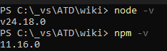

# Jak uruchomić PLVACC wiki lokalnie na komputerze?

Po co w ogóle odpalać wiki lokalnie? Jest kilka powodów, zacznę jednak od takiego, dla którego nie warto przechodzić przez ten proces. Nie warto się męczyć, jeśli chcesz tylko zobaczyć, jak będzie wyglądał Twój plik .md po udostępnieniu na wiki. Wygeneruje to każdy edytor wspierający ten format, jak Zettlr, Obsidian czy VS Code.
Kiedy natomiast warto?
1. Jeśli chcesz zmieniać sposób działania wiki - edytować menu, zakładki, szybkie linki
2. Jeśli chcesz edytować szatę graficzną - logo, kolory, czcionki, style
3. Jeśli chcesz wyświetlać pliki w formacie .mdx i dodawać niedostępne w klasycznym .md elementy, takie jak:

    <details>
        <summary>Rozwijane pola tekstowe</summary>
        <p>
            Z dodatkowymi informacjami, ciekaowstkami itp
            1. listami
            2. **pogrubienia**, _kursywa_


            czy nawet fragmetami kodu (nie wiem, może do konfiguracji EuroScope?)
            ```js
            console.log(`przykładowy kod`)
            ```
        </p>
    </details>

    albo kolorowe ramki informacyjne:


        :::note

        Kolorowe ramki aby **uwidocznić** jakieś informacje

        :::

        :::tip

        Na przykład _warto zadbać o wolny pas przed lądowaniem samolotu_

        :::

        :::danger

        Nie przydzielać squawku zawierającego ósemki

        :::

        :::info

        Some **content** with _Markdown_ `syntax`. Check [this `api`](#).

        :::

        :::warning

        Some **content** with _Markdown_ `syntax`. Check [this `api`](#).

        :::


W tych wypadkach lokalna instancja Wiki bardzo przyśpiesza pracę, nie trzeba każdorazowo wrzucać zmian na Github, czekać na deploy, walczyć z cache przeglądarki wyświetlającym starą wersję strony, zaśmiecać historii commitów itp itd.

# Wymagane kroki
1. Zainstaluj Node.js. Jest to środowisko uruchomieniowe dla JavaScript, możesz pobrać z [https://nodejs.org/en/download](https://nodejs.org/en/download)
            :::info

            Wymagany jest Node.js w wersji co najmniej 20 (See what I did here?)

            :::
2. Otwórz Powershell lub dowolny inny terminal wedle preferencji (przycisk Win + wpisz `powershell`)
3. Przejdź do folderu repozytorium PLVACC Wiki wpisując w terminalu np. `cd  C:\_vs\ATD\wiki`
4. Sprawdź, czy Node.js zainstalował się poprawnie - spróbój wywołać jego wersję komendą `node -v`. Można też sprawdzić skojarzony z nim manager pakietów, użyjemy go za chwilę do instalacji Docusaurusa. `npm -v` (npm od Node Package Manager). Jeśli obydwie komendy uruchomiły się poprawnie, tzn wyświetliły wersje aplikacji, to idziemy dalej

    
5. (Jeśli robisz to pierwszy raz, spróbuj pominąc krok 5 i przejść od razu do 6. Jeśli nie zadziała, cofnij się tu ;)) Zainstaluj Docusaurus `npm install docusaurus`
6. Uruchom projekt (pamiętając, żeby być w folderze głównym wiki) `npm start`. Po chwili powinno przenieść Cię do przeglądarki z uruchomioną lokalnie Wiki. Możesz teraz wrócić do edycji kodu. Po każdym zapisaniu projekt w przeglądarce odświeży się automatycznie.

:::caution
Zdarza się, że w wyniku niektórych zmian wywołanie komendy `npm start` kończy się błędem. Jeśli tak się stanie, spróbuj polecenia `npm run clear`. Wyczyści ono tymczasowe pliki i pamięć podręczną, w większości wypadków powinno to rozwiązać problem. 
:::

## Powodzenia!
