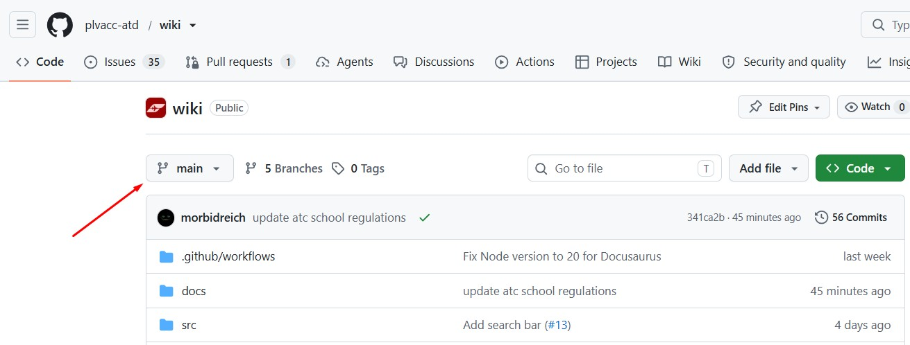
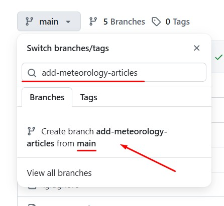
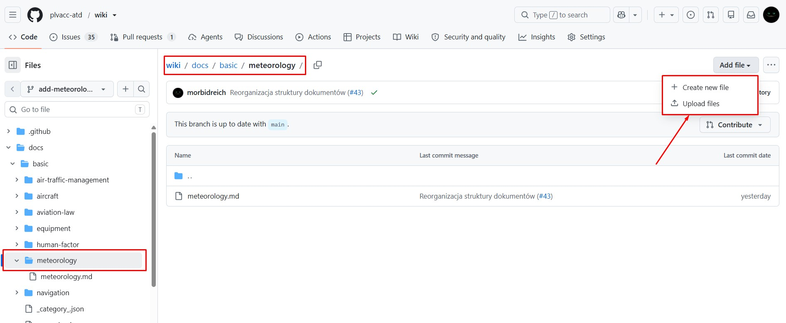
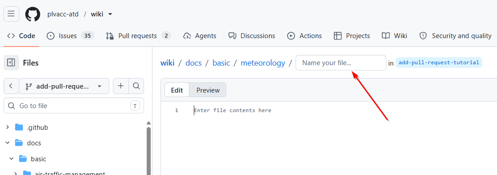
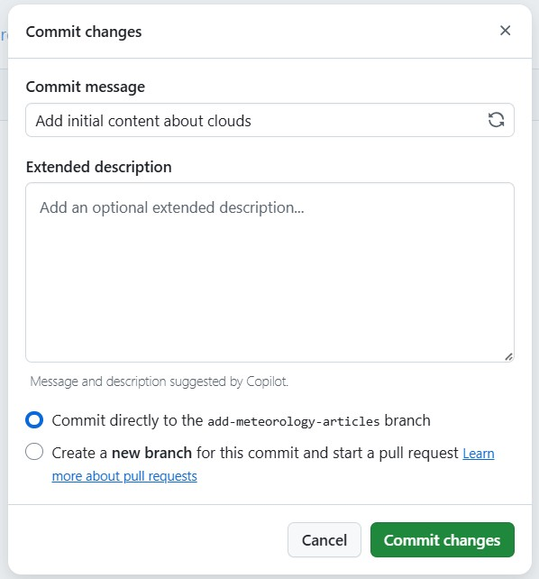
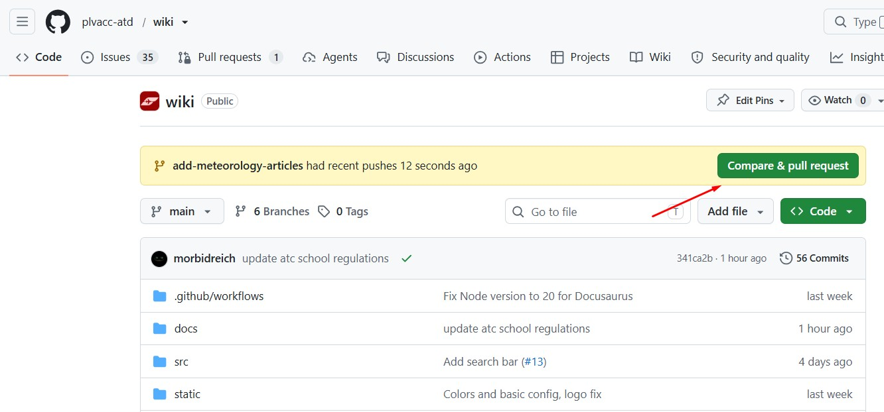
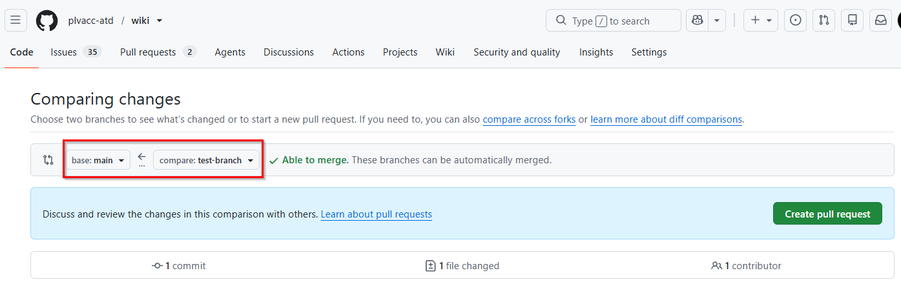
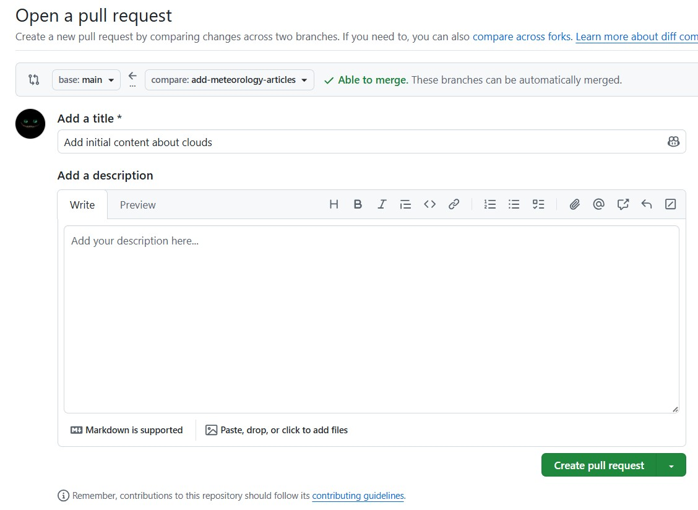
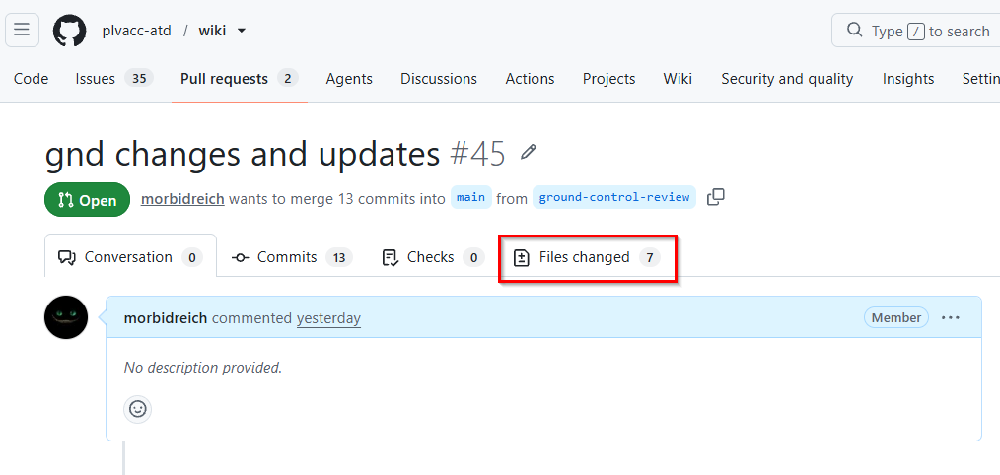

# Dodawanie zmian przez pull requesty

Artykuł przedstawia podstawowy proces wprowadzania zmian do bazy wiedzy - od utworzenia własnej gałęzi (branch), przez dodawanie i modyfikowanie plików oraz katalogów, aż po utworzenie Pull Requesta, który umożliwia recenzję zmian i włączenie treści do głównej wersji repozytorium. Opisany workflow skupia się na dodawaniu zmian z użyciem wyłącznie interfejsu strony GitHub, więc znajomość dodatkowych narzędzi do pracy z Gitem nie jest wymagana.

## Tworzenie gałęzi (branch)

W pierwszej kolejności należy utworzyć swoją gałąź (branch). Możesz o niej myśleć jak o Twojej osobistej kopii roboczej całego repozytorium. Po przełączeniu się na swój branch możesz dokonywać dowolnych zmian (włącznie ze skasowaniem całej zawartości Wiki) bez wpływu na główną gałąź repozytorium: `main`

1. Wejdź na [stronę Wiki](https://github.com/plvacc-atd/wiki) i upewnij się, że jesteś na głównej gałęzi kodu:

2. kliknij na `main`, a w oknie, które się pojawi, wpisz nazwę swojej nowej gałęzi do utworzenia. Upewnij się, że nazwa będzie odpowiadać zmianom, których planujesz dokonać, czyli np. `poprawa-bledow-i-literowek` albo `add-meteorology-article`. Dobrą praktyką jest używanie nazw w języku angielskim.

:::tip
Upewnij się, tworzysz swoją gałąź jako kopię `main` ("from **main**" na screenie powyżej), a nie innej roboczej gałęzi, która może istnieć w repozytorium.
:::

## Dodawanie plików i folderów

Wejdź do folderu, do którego chcesz dodać pliki i kliknij `Add file`

`Create new file` otworzy edytor tekstowy, który doda plik w bieżącej lokalizacji  
`Upload files` pozwoli Ci wgrać jeden lub więcej plików do bieżącego folderu

A co jeśli chcesz stworzyć folder? Kliknij `Add file -> Create new file`. W oknie, które się pojawi, w polu `Name your file` wpisz nazwę folderu i pliku jednocześnie, np. `met-reports/metar.mdx`. GitHub wykryje nazwę folderu i stworzy go automatycznie przy zapisywaniu (commitowaniu) pliku.

## Edycja pliku

Jeśli chcesz zmienić jeden z istniejących plików, wyświetl go i w prawym górnym rogu poszukaj przycisku edycji (symbol ołówka)

## Zapisywanie zmian

Po każdej akcji konieczne jest zapisanie zmian. W nomenklaturze Gita nazywa się to commitowaniem. Po edycji lub dodaniu plików znajdź i kliknij zielony przycisk `Commit changes`. W polu `Commit message` wpisz **króti** opis zmian, lub użyj sugerowanego. Jeśli chcesz dodać więcej szczegółów, użyj pola `Extended description`. Pozostaw wybraną opcję `Commit directly to the XXX branch` i ponownie kliknij `Commit changes`.

:::tip
Przy wprowadzaniu zmian warto pamiętać o kilku zasadach:
- w ramach swojego brancha roboczego możesz modyfikować / dodawać / usuwać jeden lub więcej plików, dowolną ilość razy;
- zmiany powinny dotyczyć jednego zagadnienia. To znaczy, że jeśli chcesz dodać artykuł do wiki, ale jednocześnie też zaktualizować częstotliwość EPKK_TWR w kilku plikach, to powinieneś stworzyć do tych zmian dwie osobne gałęzie. Taka 'atomizacja' pozwala izolować zagadnienia, lepiej śledzić zmiany na wiki i w razie konieczności łatwiej wycofywać / poprawiać pojedyncze tematy.
:::

## Tworzenie pull requesta

Dobrnęliśmy prawie do końca. Wszystkie zmiany są wprowadzone, jesteś gotów do przedstawienia swoich zmian recenzentom. Służy do tego 'Pull request', czyli potocznie propozycja wciągnięcia zmian na główną gałąź. Jeśli dopiero skończyłeś commitować swoje zmiany, to przejdź na główną stronę repozytorium. W powiadomieniu kliknij `Compare & pull request`.

Jeśli powiadomienie nie pojawiło się, trzeba będzie stworzyć pull request manualnie. W menu na górze strony znajdź i kliknij `Pull requests`, a na kolejnej stronie `New pull request`
W oknie które się pojawi, najważniejsze, żebyś wybrał branch docelowy `main` i branch, który chcesz do niego włączyć. Zatwierdź zmiany klikając `Create pull request`.

Dotarliśmy do ostatniego kroku. W polu `Add a title` dodaj krótką nazwę proponowanej zmiany. Będzie to informacja widoczna w historii repozytorium, więc postaraj się, aby dobrze oddawała charakter zmian. Jeśli chcesz, możesz zostawić dodatkowe informacje kontekstowe w polu `Add a description`.

Klik w `Create pull request` na dole strony ostatecznie kończy proces.

:::tip
Przydatne informacje:
- po stworzeniu Pull requesta nadal możesz dodawać zmiany na swojej gałęzi roboczej, pull request zawsze automatycznie zaktualizuje się po wprowadzeniu przez Ciebie zmian
- warto spojrzeć na podsumowanie zmian wprowadzonych w plikach klikając na `Files changed`
   
  
  Jest to świetne narzędzie do ostatecznego sprawdzenia proponowanej przez nas zmiany przed wkroczeniem recenzentów do akcji.
:::

## Publikacja zmian

Z Twojej strony to wszystko. Gdy uprawniony recenzent zatwierdzi Twoje zmiany, zostaną one automatycznie opublikowane na Wiki. Pamiętaj, żeby posprzątać po sobie i usunąć swoją roboczą gałąź po skończeniu pracy nad danym zagadnieniem.