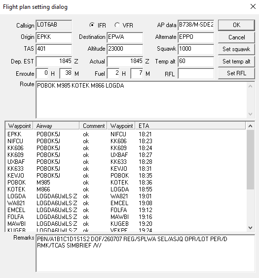

# Sprawdzenie poprawności planu lotu
Jednym z pierwszych i kluczowych obowiązków kontrolera ruchu lotniczego (KRL) na pozycji **Delivery** jest weryfikacja planu lotu złożonego przez pilota. Kontroler ma obowiązek sprawdzić i w razie potrzeby poinformować pilota o ewentualnych nieprawidłowościach przed wydaniem zezwolenia na lot.

## Znak wywoławczy
Znak wywoławczy w planie lotu może składać się z maksymalnie 7 znaków alfanumerycznych (bez użycia łączników lub symboli specjalnych) i przybierać jedną z następujących form:

- zaakceptowany przez ICAO oznacznik użytkownika, po którym następuje identyfikator lotu (np.
  KLM511, LOT2PZ, WZZ25),

- znak oznaczający narodowość lub wspólne oznaczenie i znak rejestracyjny statku powietrznego
  (np. EIAKO, SPKNA, N2567GA).

## Przepisy wykonywania lotu
Jeżeli chodzi o przepisy według których pilot wykonuje lot, to na VATSIM mamy do wyboru **I - IFR** lub **V - VFR**. Warto zweryfikować to patrząc np. na trasę i gdy pojawiają się jakieś wątpliwości co do prawidłowości planu lotu, należy zapytać pilota o intencje, tj. czy rzeczywiście chce wykonywać lot tak, jak podał w planie lotu. W przypadku lotu VFR trzeba pamiętać że może on być wykonywany w warunkach **VMC** (wyjątek - lot specjalny VFR oraz operacje HEMS).
:::danger
DO ZROBIENIA - DODAĆ ODWOŁANIE DO SVFR oraz VMC
:::

## Typ statku powietrznego oraz kategoria turbulencji w śladzie aerodynamicznym
**Typ statku powietrznego** zawiera od 2 do 4 znaków. Należy wpisać właściwy oznacznik zgodnie z dokumentem Doc 8643 ICAO (Aircraft Type Designators). Jeżeli dla danego typu nie przydzielono oficjalnego oznacznika, należy wpisać ZZZZ, a w polu remarks podać pełną nazwę konstrukcji, poprzedzając ją słowem kluczowym TYP/.

**Kategoria turbulencji w śladzie aerodynamicznym** wpisywana jest po ukośniku definiującym typ statku powietrznego. Należy wprowadzić jednoznakowe oznaczenie kategorii śladu aerodynamicznego, określone na podstawie maksymalnej certyfikowanej masy startowej (MTOW - Maximum Take-Off Weight):

- J (SUPER) typy statków powietrznych określone w Doc 8643,
- H (CIĘŻKI) MTOW powyżej 136 000 kg z wyjątkiem typów statków powietrznych określonych w Doc 8643,
- M (ŚREDNI) MTOW od 7 000 kg do 136 000 kg,
- L (LEKKI)  MTOW równa 7 000kg lub mniej.

## Wyposażenie i możliwości
Deklaracja **wyposażenia** w planie lotu potwierdza spełnienie trzech warunków:
- obecność na pokładzie sprawnego i certyfikowanego wyposażenia,
- posiadanie przez załogę odpowiednich uprawnień i kwalifikacji do jego obsługi,
- uzyskanie stosownych zatwierdzeń operacyjnych (upoważnień) od właściwego organu nadzoru lotniczego (jeśli są wymagane).

Prawidłowe podanie wyposażenia:
- N - wpisuje się, jeżeli na pokładzie nie ma wyposażenia w pomoce COM/NAV/podejścia dla zamierzonej
  trasy lotu lub wyposażenie takie jest niesprawne,
- S - wpisuje się, jeżeli na pokładzie znajduje się sprawne standardowe wyposażenie w pomoce
  COM/NAV/podejścia dla zamierzonej trasy lotu. Za standardowe wyposażenie uważa się VHF RTF, VOR i ILS, chyba że
  właściwa władza ATS ustaliła inną kombinację,
- oraz/lub wpisać jedną lub więcej z następujących liter w celu podania posiadanego i sprawnego wyposażenia i
  możliwości COM/NAV/podejścia:

        
Oznaczenia wyposażenia i możliwośći:

        

            A - System lądowania GBAS, 
            B - LPV (APV z SBAS), 
            C - LORAN, 
            D - DME, 
            E1 - FMC WPR ACARS, 
            E2 - D-FIS ACARS, 
            E3 - PDC ACARS, 
            F - ADF, 
            G - GNSS, 
            H - HF RTF, 
            I - Nawigacja bezwładnościowa, 
            J1 - CPDLC ATN VDL Mode 2, 
            J2 - CPDLC FANS 1/A HFDL, 
            J3 - CPDLC FANS 1/A VDL Mode 4, 
            J4 - CPDLC FANS 1/A VDL Mode 2, 
            J5 - CPDLC FANS 1/A SATCOM (INMARSAT), 
            J6 - CPDLC FANS 1/A SATCOM (MTSAT), 
            J7 - CPDLC FANS 1/A SATCOM (Iridium), 
            K - MLS, 
            L - ILS, 
            M1 - ATC SATVOICE (INMARSAT), 
            M2 - ATC SATVOICE (MTSAT), 
            M3 - ATC SATVOICE (Iridium), 
            O - VOR, 
            P1 - CPDLC RCP 400, 
            P2 - CPDLC RCP 240, 
            P3 - SATVOICE RCP 400, 
            P4-P9 - Zarezerwowane dla RCP, 
            R - Zgodny z PBN, 
            T - TACAN, 
            U - UHF RTF, 
            V - VHF RTF, 
            W - Zgodny z RVSM, 
            X - Zgodny z MNPS, 
            Y - VHF z separacją kanałową 8.33 kHz, 
            Z - Inne posiadane wyposażenie lub możliwości.
        

    

Wyposażenie i możliwości dozorowania:

- SSR mody A i C:
  - N - jeżeli dla trasy, po której ma być wykonany lot, brak jest wymaganego wyposażenia
    dozorowania lub jest ono niesprawne,
  - A - transponder mod A,
  - C - transponder mod A + C.
- SSR mod S:
  - E - mod S z podawaniem znaku rozpoznawczego statku powietrznego, wysokości barometrycznej i rozszerzonymi możliwościami squittera (ADS-B), 
  - H - mod S z podawaniem znaku rozpoznawczego statku powietrznego, wysokości barometrycznej i rozszerzonymi możliwościami dozorowania, 
  - I - mod S z podawaniem znaku rozpoznawczego statku powietrznego, ale bez wysokości barometrycznej, 
  - L - mod S z podawaniem znaku rozpoznawczego statku powietrznego, wysokości barometrycznej oraz rozszerzonymi możliwościami squittera (ADS-B) i rozszerzonymi możliwościami dozorowania, 
  - P - mod S z podawaniem wysokości barometrycznej, lecz bez podawania znaku rozpoznawczego statku powietrznego, 
  - S - mod S z podawaniem zarówno wysokości barometrycznej jak i znaku rozpoznawczego statku powietrznego, 
  - X - bez podawania znaku rozpoznawczego statku powietrznego, ani wysokości barometrycznej. 

## Lotnisko odlotu, przylotu, zapasowe oraz EOBT
Zarówno dla lotniska odlotu, przylotu oraz zapasowego wpisuje się przyjęty czteroliterowy wskaźnik lokalizacji lotniska określony w Doc 7910 ICAO. W przypadku gdy taki wskaźnik nie został przydzielony, zapisuje się ZZZZ oraz podać należy w polu remarks nazwę lotniska lub w przypadku terenu przygodnego np. pobliską miejscowość, poprzedzoną odpowiednio skrótem DEP/, DEST/ lub ALTN/.

**EOBT** - Estimated Off-Block Time. Jest to przewidywany czas, w którym SP opuści swoje stanowisko postojowe czy to przez wypychanie, czy też kołowanie w przypadku stanowisk przelotowych. KRL wydaje zezwolenie na lot najwcześniej 30 minut przed EOBT.

:::warning
W przypadku gdy EOBT jest w przeszłości, pilota powiadamia się o wygaśnięciu ważności jego planu lotu oraz obowiązku wysłania nowego z prawidłowym EOBT (jeżeli czas na to pozwala, można zedytować aktualny plan lotu po wcześniejszym uzyskaniu nowego EOBT od pilota).
:::
## Trasa
KRL ma obowiązek sprawdzić prawidłowość trasy do granic polskiego FIRu (zalecane sprawdzenie całej trasy). W trasie mogą znaleźć się:
- pomoce radionawigacyjne m.in. VOR, NDB np. `KAK`,
- określone punkty nawigacji obszarowej np. `BAVOK`,
- opisane punkty VFR zgodnie z AIP:
    - ICAOx - np. `EPKTB` - jako punkt VFR BRAVO dla lotniska EPKT,
    - AICAO - np. `AEPKT` - Punkt referencyjny lotniska EPKT.
- nazwy geograficzne miejscowości, o ile zapisane są w odpowiednim formacie:
    - `Route: 5020N01912E`, `Remarks: 5020N01912E KATOWICE`,
- dowolny inny punkt opisany współrzędnymi, np.: `Route: 5018N01857E`, `Remarks: 5018N01857E PARK SLASKI CHORZOW`,
- pomiędzy punktami wpisuje się drogi lotnicze lub gdy lot nie odbywa się po drogach lotniczych, między punktami należy wpisać DCT.
:::caution
Nie wpisujemy DCT między kolejnymi punktami wyznaczonymi współrzędnymi lub namiarem i odległością od pomocy nawigacyjnej.
:::

Punkt, w którym planowane jest rozpoczęcie zmiany prędkości (o 5% TAS lub 0,01 Macha lub więcej) lub zmiany
poziomu, oznacza sie w nastepujący sposób np. `MAY/N0305F180`, `HADDY/N0420F330`.

Punkt, w którym jest planowana zmiana przepisów wykonywania lotu, oznacza się stosując odstęp oraz jeden z następujących skrótów:
- VFR — gdy ma nastąpić zmiana z IFR na VFR np. `KK659 VFR`,
- IFR — gdy ma nastąpić zmiana z VFR na IFR np. `OFFUK IFR`.

:::tip
Należy również sprawdzić czy:
- trasa nie posiada punktów terminalowych np. `WA901`, `OFFUK`,
- trasa nie posiada SID oraz STAR dla polskich lotnisk (w zależności od państwa, czasami wpisuje się je do trasy, natomiast w Polsce w przypadku procedury SID pierwszym punktem w planie lotu powinien być ostatni punkt danego SID, a w przypadku planowanego dolotu zgodnie z procedurą STAR, ostatnim punktem w planie lotu powinien być pierwszy punkt planowanej procedury STAR).
:::

:::info
Warto również wspomnieć o wskażniku **STAY**. Służy wpisaniu do planu lotu opóźnień wynikających z innych działań w locie np.: krąg nadlotniskowy, zrzut skoczków spadochronowych oraz wiele innych. 

Pawidłowy zapis wygląda następująco `Route: EPKKB STAY1/0020 EPKKB`, `Remarks: STAYINFO1/BIRD PHOTOGRAPHY`. Oznacza to opóźnienie trwające 20 minut zaczynające się i kończące się nad punktem BRAVO lotniska Kraków Balice; w polu remarks możemy doczytać, że opóźnienie wynika z fotografowania ptaków.
:::

## Poziom przelotu
Należy sprawdzić czy poziom przelotu został prawidłowo dobrany(patrz [Poziomy lotu](docs/basic/air-traffic-management/05-air-traffic-management-flight-levels.md)).

## Remarks
W polu remarks piloci zamieszczają dodatkowe informacje. Oprócz tego co zostało już wymienione mogą pojawić się tam informacje o NEWBIE PILOT czy też o tym, jak brzmi pełna forma danego znaku wywoławczego. Kontroler powinien w miarę możliwości czasowych zweryfikować informacje zawarte w tej sekcji planu lotu.

## Przykład
Poniżej możemy zobaczyć przykładowy plan lotu. Rozbijemy go na czynniki pierwsze:

 
Callsign: LOT6AB, 
IFR -zasady wykonywania lotu według wskazań przyrządów, 
AP DATA: B738/M-SDE2E3FGHIRWXY/LB1 - rodzaj, wyposażenie i możliwości statku powietrznego, 
Origin: EPKK - lotnisko odlotu - Kraków - Balice, 
Destination: EPWA - lotnisko przylotu - Lotnisko Chopina w Warszawie, 
Alternate: EPPO - lotnisko zapasowe - Poznań - Ławica, 
TAS: 401 - prędkość przelotowa, 
Altitude: 23000 - poziom przelotu, 
Squawk: 1000 - squawk przypisany przez kontrolera (przed przypisaniem go to pole będzie puste), 
Dep. EST: 1845Z - EOBT, 
Actual: 1845Z - CTOT (Calculated Take-Off Time), 
Temp alt: 60 - wysokość/poziom lotu do którego SP ma zezwolenie wznosić po starcie (potocznie zwany initial climb altitude), 
Enroute: 0H38M - planowany czas przelotu, 
Fuel: 2H7M - czas na jaki starczy paliwa, 
Route: POBOK M985 KOTEK M866 LOGDA - jak widać trasa zaczyna się ostatnim punktem SID oraz kończy pierwszym punktem STAR oraz przebiega wzdłuż dróg lotniczych, 
Remarks: PBN/A1B1C1D1S1S2 DOF/260707 REG/SPLWA SEL/ASJQ OPR/LOT PER/D RMK/TCAS SIMBRIEF /V/ - dodatkowe informacje od pilota.