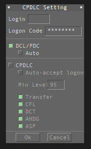
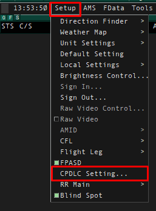
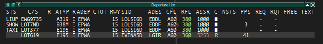
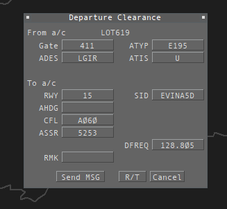

# DCL i PDC

Zezwolenie na lot można wydać nie tylko drogą głosową, ale również elektronicznie. Można to zrobić w jednym z dwóch standardów: DCL lub PDC.

## Departure Clearance (DCL)

**Departure Clearance (DCL)** jest usługą opartą o **CPDLC (Controller–Pilot Data Link Communications)**, która umożliwia przekazanie pilotowi zezwolenia na lot w formie wiadomości tekstowej.

Po nawiązaniu połączenia CPDLC pilot może wysłać prośbę o wydanie zezwolenia. Kontroler przygotowuje je i przesyła drogą cyfrową, a pilot potwierdza jego otrzymanie bez konieczności używania częstotliwości radiowej.

DCL przekazuje dokładnie te same informacje, które zostałyby wydane drogą głosową, między innymi:
- procedurę SID,
- poziom początkowy,
- kod transpondera,
- ewentualne dodatkowe instrukcje.

:::tip 
Zalety DCL
- odciąża częstotliwość radiową,
- eliminuje ryzyko błędnego zrozumienia zezwolenia,
- pozwala pilotowi w każdej chwili wrócić do otrzymanej wiadomości,
- usprawnia pracę podczas dużego natężenia ruchu.
:::

## Pre-Departure Clearance (PDC)

**Pre-Departure Clearance (PDC)** również służy do przekazywania pilotowi zezwolenia IFR przed odlotem, jednak działa w inny sposób niż DCL.

W systemie PDC zezwolenie jest generowane i dostarczane pilotowi za pośrednictwem dedykowanych systemów operacyjnych. Nie jest ono elementem komunikacji CPDLC pomiędzy pilotem i kontrolerem.

PDC stosowane jest przede wszystkim przez operatorów posiadających odpowiednią infrastrukturę umożliwiającą odbiór takich wiadomości jeszcze przed uruchomieniem łączności z kontrolą ruchu lotniczego.

:::info
Gdzie stosuje się PDC?
PDC wykorzystywane jest głównie w Stanach Zjednoczonych Ameryki. Korzystają z niego przede wszystkim operatorzy komercyjni posiadający odpowiednie systemy operacyjne.
:::

## Różnice pomiędzy DCL i PDC

| DCL | PDC |
|------|------|
| Oparte o komunikację **CPDLC**. | Nie wykorzystuje komunikacji CPDLC. |
| Zezwolenie wysyłane jest bezpośrednio przez kontrolera. | Zezwolenie dostarczane jest przez dedykowane systemy operacyjne. |
| Pilot komunikuje się z organem ATC poprzez wiadomości CPDLC. | Pilot otrzymuje gotowe zezwolenie bez prowadzenia wymiany wiadomości z kontrolerem. |

## Połączenie się z CPDLC

Korzystanie z funkcji DCL jest bardzo proste. Do poprawnego działania tego systemu potrzebny jest kod Hoppie, który możesz uzyskać [na stronie Hoppie's ACARS](https://www.hoppie.nl/acars/system/register.html)

Kod należy skopiować z otrzymanego maila, oraz wkleić go do pliku **TopSkyCPDLChoppieCode.txt**, który możesz znaleźć w *EPWW\Plugins\TopSky\TWR* oraz *EPWW\Plugins\TopSky\RADAR*.

Po zalogowaniu do sieci w lewym górnym rogu pokaże się okienko *CPDLC Setting*.

:::tip 
Jeżeli takie okienko się nie pojawi, lub jeżeli je zamkniesz i chcesz je ponownie otworzyć, możesz to zrobić w następujący sposób:
- wykorzystując *POLAND TWR ATOS/DARK* przechodząc w widok **EPWW_TWR** (klikając F1 > 1) a następnie z paska TopSky wybrać ***Setup*** a następnie ***CPDLC Setting...***.
- wykorzystując *POLAND RADAR* z paska TopSky wybrać ***Setup*** a następnie ***CPDLC Setting...***.

:::

Aby poprawnie połączyć się do CPDLC, musisz upewnić się, że zaznaczona jest funkcja **DCL/PDC**, że wpisany jest Logon Code (jeżeli kod Hoppie został zapisany w pliku wyżej wskazanym, to pole będzie już automatycznie uzupełnione), oraz że wpisany jest poprawny login. Pole "Login" powinno się wypełnić automatycznie.

:::tip
Kontroler wydający zezwolenia powinien być połączony z loginem odpowiadający danemu lotnisku.
Przykład: jeżeli zalogowane jest: EPWA_DEL, EPWA_GND, EPWA_TWR, to kontroler EPWA_DEL powinien podłączyć CPDLC z loginem ***EPWA***.
Loginy obowiązują odpowiednio dla każdego lotniska (np. na EPGD login to **EPGD**, na EPKK login to **EPKK**).
:::

Jeżeli wszystko jest dobrze ustawione, klikamy **"Connect"** i wszystko mamy podłączone! Teraz czekamy, aż załoga wyśle prośbę o zezwolenie na lot.

## Wydawanie zezwolenia przez DCL w praktyce

Gdy załoga wyśle prośbę przez DCL, to w Departure List ukaże nam się żółta litera R w polu C (Clearance Receive Flag).

Aby otworzyć okno DCL celem wysłania zezwolenia, należy prawym przyciskiem myszy nacisnąć na literę R.

:::tip
Jeśli omyłkowo klikniesz wcześniej w to samo miejce lewym przyciskiem myszy, okno DCL może się nie otworzyć mimo braku jakichkolwiek widocznych zmian na Departure List. Rozwiązaniem problemu może być ponowne kliknięcie w kolumnie C (Clearance Receive Flag) lewym przyciskiem myszy. Wówczas kolejne kliknięcie prawym przyciskiem powinno otworzyć okno DCL.
:::

Okno Departure Clearance wygląda następująco:

Pierwsza część **From a/c**, pokazuje nam, co pilot zgłasza:
**Gate** - stanowisko, na którym stoi,
**ATYP** - Aircraft Type, czyli rodzaj statku powietrznego,
**ADES** - Destination Airport, czyli lotnisko docelowe,
**ATIS** - Informacja ATIS, z którą pilot jest zapoznany.

W tym wypadku widzimy, że LOT619 stoi na stanowisku 411, prosi o zezwolenie na lot do LGIR (Heraklion) i będzie lecieć Embraerem E195, a załoga zapoznała się z informacją U.

Poniżej widzimy pole **To a/c**. Sa to informacje wysyłane do pilota.
**RWY** - pas z którego odbędzie się odlot,
**SID** - procedura odlotowa SID,
**AHDG** - *OPCJONALNIE* - w standardzie ta opcja jest pusta. Chodzi w niej o to, że jeżeli chcemy aby SP wykonywał niestandardowy odlot (np. utrzymywanie określonego kursu po odlocie), wpisujemy żądany kurs ręcznie,
**CFL** - Cleared Flight Level, czyli zezwolona wysokość do której ma wznosić SP (inaczej initial climb),
**ASSR** - Assigned SSR code, czyli przydzielony kod transpondera,
**DFREQ** - Departure Frequency, czyli częstotliwość, jaką pilot powinien dostać po odlocie,
**RMK** - ewentualnie informacje, które chcemy podać pilotowi. Na przykład chcemy, aby pilot zgłosił przy prośbie na uruchamianie/wypychanie, z której intersekcji pasa chce startować (*ON INITIAL CONTACT REPORT REQUESTED INTERSECTION FOR DEPARTURE*), czy aktualny czas TSAT (w przypadku EPWA, *TSAT XXXX, YOU CAN UPDATE YOUR TOBT ON VATS.IM/EPWA-ACDM*)

Jeżeli Departure List jest poprawnie uzupełniona, w oknie do DCL wszystko wypełni się automatycznie - Twoim zadaniem jest to jedynie zweryfikować.

Jeżeli wszystko się zgadza, na dole mamy 3 opcje:
**SEND MSG** - wysyła zezwolenie DCL do pilota,
**R/T** - Revert To Voice, np., gdy plan lotu jest nieprawidłowy. System wysyła wtedy wiadomość do pilota, aby zgłosił się po zezwolenie na radiu.
**Cancel** - zamyka tylko okienko, nie wysyła zezwolenia ani polecenia na zgłoszenie się na radiu.

W momencie gdy pilot zaakceptuje zezwolenie, prostokąt odpowiadający za pole **Clearance Received Flag** zmieni kolor (na biały), tak jakbyśmy to my zaznaczyli poprawne odczytanie zezwolenia.
