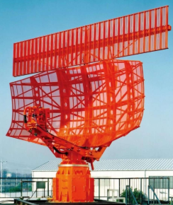
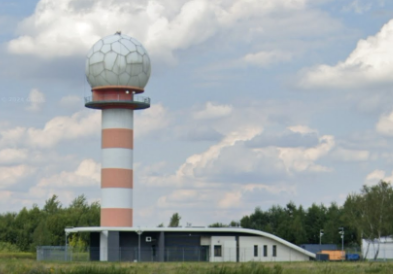
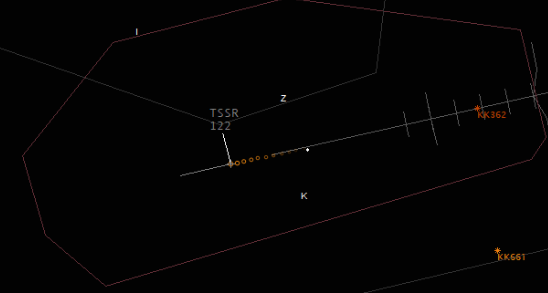
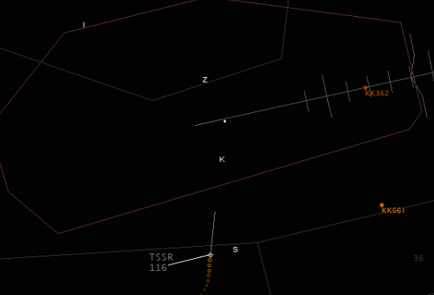

# Identyfikacja statków powietrznych

## Wstęp

Aby zrozumieć zagadnienie i istotność identyfikacji statków powietrznych w służbie kontroli lotniska, trzeba zrobić krok wstecz w stosunku do techniki pracy za pomocą naszych codziennych narzędzi używanych w sieci VATSIM.

Wyobraź sobie, że logując się na pozycję Kraków Wieża (EPKK_TWR), nie widzisz w Euroscope znajomego podglądu płyty lotniska oraz CTRu, które z perfekcyjną dokładnością obrazują położenie każdego samolotu zalogowanego w sieci. W zamian za to znajdujesz się w symulowanej wieży, widzisz okna, przez które obserwujesz lotnisko i przestrzeń powietrzną. Informacje o samolotach dostępne są tylko na listach Arrival i Departure. Nagle słyszysz przez radio:
> **PILOT:** Kraków wieża, SPABC, w dolocie do punktu Sierra, altitude 2000 stóp, proszę o zezwolenie na wlot do przestrzeni kontrolowanej, w planie pełne lądowanie

Gdzie dokładnie znajduje się samolot? O której doleci do lotniska? Twoje rozważania przerywa kolejna transmisja:
> **PILOT:** Kraków Tower, LOT5MN, established ILS runway 25
 
Sytuacja się powtarza: ile mil do pasa ma LOT5MN? Jak szybko leci? Czy wyląduje pierwszy? Czy może jest na tyle daleko, że SPABC zdąży wylądować przed nim? W jaki sposób ocenić sytuację? Samoloty są za daleko, żeby wypatrzyć je przez okno. Jedyna opcja na zdobycie informacji potrzebnych do zaplanowania ruchu to pytania do pilotów:
> **ATC:** SPABC, Wieża, o której przewidujesz punkt K? 
> **ATC:** LOT5MN, Tower, report distance to threshold
 
Opisana sytuacja przedstawia w dużym uproszczeniu technikę pracy na wieży bez wykorzystania kontroli radarowej. Wraz ze wzrostem ruchu i rozwojem infrastruktury na coraz większej ilości wież instalowane były wskaźniki radarowe, a personel zdobywał uprawnienia do ich wykorzystania operacyjnego. Niosło to ze sobą zdecydowaną poprawę świadomości sytuacyjnej, możliwość monitorowania toru lotu statków powietrznych, udzielania asysty nawigacyjnej czy podawania dużo dokładniejszych informacji o ruchu. Aby mieć dostęp do dobrodziejstw informacji uzyskiwanych z radaru trzeba spełnić kilka dodatkowych warunków. Zanim jednak zagłębimy się w szczegóły, zapoznamy się z uproszczoną teorią działania podstawowych systemów dozorowania.

## Podstawy teoretyczne

### Systemy radarowe

Radary, z których korzysta się w służbie kontroli ruchu lotniczego, dzielą się na dwie podstawowe grupy:
* Radary pierwotnye (_PSR - primary surveillance radar_) - emitują wiązkę promieniowania o bardzo dużej mocy i nasłuchują odpowiedzi odbitych od obiektów w przestrzeni. Ta nadchodzi, gdy promieniowanie odbije się od samolotu i zostanie zarejestrowana przez odbiornik radaru. Radary pierwotne są samowystarczalne, znaczy to, że nie potrzebują dodatkowego wyposażenia na pokładzie statku powietrznego, żeby go wykryć. Jest to duży atut, głównie z punktu widzenia wojska, gdzie samoloty raczej unikają wykrycia, ale też w zastosowaniach cywilnych - radar PSR  nadal jest w stanie wykryć samolot z awarią transpondera. Takie rozwiązanie ma też wady. Radar pierwotny potrzebuje do działania dużo więcej energii. Dodatkowo wykrywa wszystkie obiekty, które odbijają promieniowanie elektromagnetyczne, więc poza samolotami będzie to ukształtowanie terenu, budowle czy nawet obszary złej pogody (ostatni czynnik w pewnych okolicznościach może być zaletą, efekt ten używany jest w radarach pogodowych)
* Radary wtórne (_SSR - secondary surveillance radar_) - do działania wymagany jest dodatkowo działający transponder na pokładzie statku powietrznego. Radar wysyła w przestrzeń dużo słabszy sygnał, który jeśli dotrze do statku powietrznego, aktywuje odpowiedź transpondera. To, czego nasłuchuje radar wtórny, to nie echo odbite od samolotu (jak przy PSR), ale sygnał nadany w odpowiedzi przez transponder statku powietrznego. Jeśli pilot nie włączy transpondera, radar wtórny nie wykryje takiego statku powietrznego. Plusami takiego rozwiązania są dużo mniejsze zużycie energii oraz lepsza selektywność wykrywanych obiektów. Przykładowo: o ile wzgórze nie jest wyposażone w transponder, nie będzie pojawiać się jako wykryty obiekt;) Wadą jest oczywiście zależność od wyposażenia statku powietrznego w transponder.

W pobliżu lotnisk radary PSR/SSR przeważnie instalowane są razem. Szeroka, prostokątna antena na górze to radar wtórny, ta bardziej zaokrąglona to radar pierwotny.

Najczęściej jednak można spotkać się z charakterystycznymi “piłkami golfowymi”. Radar zamyka się w okrągłej obudowie wykonanej z niewidocznego dla fal elektromagnetycznych tworzywa sztucznego, chroniącego anteny od wpływu warunków atmosferycznych.

### Nieradarowe systemy dozorowania

Poza systemami radarowymi istnieją też inne, choć niesymulowane w vFIR EPWW rozwiązania pozwalające na wykrywanie statków powietrzncyh w przestrzeni:
* ADS-B (Automatic Dependent Surveillance – Broadcast) działa w oparciu o dane pokładowe: statek powietrzny samodzielnie określa swoją pozycję (zwykle z GPS) i cyklicznie nadaje ją drogą radiową wraz z prędkością i wysokością, bez potrzeby odpytywania przez system naziemny. To właśnie z tych danych korzystają serwisy takie jak [FlightRadar24](https://www.flightradar24.com) albo [ADS-B Exchange](https://globe.adsbexchange.com/)

* Multilateracja - pasywny system składający się z wielu stacji nasłuchujących transmisji wysyłanych przez transpondery statków powietrznych. Sygnał z danego transpondera dotrze do różnych stacji w różnym czasie. Znając różnice w czasie odbioru oraz współrzędne każdej stacji algorytmy z pomocą matematyki są w stanie obliczyć dokładną pozycję statku powietrznego. 

:::info
Wobec rozpowszechniania się systemów nieradarowych, takich jak ADS-B czy multilateracja, odchodzi się od pojęcia **służba radarowa** na rzecz pojęcia szerszego, obejmującego nowe rozwiązania techniczne: **służba dozorowania**. Dla wygody w dalszej części artykułu będę się jednak posługiwał tymi pojęciami zamiennie.  
:::

## Wykorzystanie radaru na TWR

Aktualny wykaz służb, w których zapewnia się służbę dozorowania można znaleźć w AIP ENR 1.6. W czasie pisania z radaru można korzystać w CTRach następujących lotnisk:
* EPGD
* EPKK
* EPKT
* EPMO
* EPPO
* EPRZ
* EPWA
* EPWR

Zgodnie z **DOC 4444 pkt 8.10.1.1** systemy dozorowania w kontroli lotniska mogą być stosowane w celu spełniania następujących funkcji:
1. monitorowania toru lotu statków powietrznych na podejściu końcowym, w tym 
    1. prędkości
    1. odległości od progu
    1. kolejności podchodzących
    1. separacji między kolejnymi podchodzącymi
1. monitorowania toru lotu innych statków powietrznych w pobliżu lotniska
    1. ruch w kręgu
    1. statki powietrzne przecinające CTR
    1. doloty i odloty VFR
1. zapewnienie asysty nawigacyjnej dla lotów VFR

Wobec powyższego przepisu może rodzić się pytanie: _"czy my i tak nie kontrolujemy właśnie w taki sposób, wykorzystując podgląd w EuroScope, bez względu, czy na danym lotnisku radar jest dopuszczony do wykorzystania operacyjnego, czy to na Okęciu, czy w Szczecinie?"_ Tu można wrócić do wstępu do artykułu. Euroscope jest jedynym narzędziem kontrolera na VATSIM. Różnica jest więc w procedurach, które zastosuje oraz świadomości technik pracy dostępnych na danym lotnisku. Przykładowo, kontroler na Okęciu może samodzielnie zaobserwować na zobrazowaniu radarowym, że samolot opuszcza CTR i w tym momencie zakończyć służbę kontroli ruchu lotniczego. W Szczecinie z kolei, mimo że dysponujemy dokładnie tą samą informacją i podglądem, możemy zasymulować pracę nieradarową i zdać się na meldunki pozycyjne, prosząc pilota o zgłoszenie opuszczenia przestrzeni kontrolowanej. 

## Metody identyfikacji

Aby móc operacyjnie wykorzystywać dane radarowe, konieczna jest wcześniejsza identyfikacja statku powietrznego. Przez identyfikację rozumiemy wykonanie opisanych przepisami czynności, które pozwalają nam upewnić się co do tożsamości konkretnego statku powietrznego widocznego na wskaźniku radarowym, czyli upewnić się, że ta konkretna kropka (blip) na ekranie to właśnie ten, a nie inny samolot. Identyfikowanie nie jest obowiązkowe, należy jednak pamiętać, że wobec niezidentyfikowanych statków powietrznych nie zapewniamy służby radarowej. Istotny jest też warunek definiowany przez DOC 4444 pkt 8.6.2.1.1:
> Przed rozpoczęciem zapewnienia statkowi powietrznemu służby dozorowania ATS, identyfikacja jest ustanawiana **a pilot jest o tym informowany**. Następnie identyfikacja jest utrzymywana aż do zakończenia zapewniania służby dozorowania ATS.

> **ATC:** SPABC, wieża, zidentyfikowany 
> **ATC:** SPABC, tower, identified

> **ATC:** SPABC, wieża, w kontakcie radarowym 
> **ATC:** SPABC, tower, radar contact

Jeśli nie mamy pewności co do tożsamości identyfikacji statku powietrznego, w dowolnym momencie można ponownie zastosować dowolną z dostępnych metod.
Poniżej przedstawione zostaną niektóre z metod identyfikacji za pomocą radaru pierwotnego i wtórnego. Pełna lista dostępna jest w DOC 4444 rozdział 8.6.2

### Identyfikacja PSR

**Identyfikacja po odlocie, jeśli nastąpi maksymalnie 1NM od końca drogi startowej** Jeśli wydaliśmy zezwolenie na start, a chwilę po oderwaniu się samolotu obserwujemy echo na radarze, możemy być pewni tożsamości tego echa. Gdy pilot nie włączy transpondera, to nadal można go zidentyfikować właśnie na podstawie radaru pierwotnego (symbol pozycji to “+”) “SPABC zidentyfikowany po starcie/SPABC identified after departure”, jak na obrazku poniżej:

**Wydanie polecenia zmiany kursu o 30 stopni lub więcej** blisko temu do wektorowania, które jest zazwyczaj niedostępne (można pilota VFR nieumyślnie skierować w kierunku przeszkody albo wywektorować z VMC). Można za to wydać polecenie wykonania orbity - for identification make one orbit to the right/left; dla identyfikacji wykonaj oribtę w prawo/lewo. Nadal jest to polecenie zmiany kursu o 30 stopni lub więcej, którą da się zaobserwować na radarze. Należy zwrócić uwagę, żeby w okolicy nie było innego ruch wykonującego podobne manewry i utrudniającego identyfikację (np inny pilot oczekujący nad punktem VFR).

**Identyfikacja na podstawie meldunku pozycyjnego** - Jeśli przy nawiązywaniu łączności statek powietrzny poda pozycję i zgadza się ona z echem obserwowanym na radarze, identyfikacja jest ustanowiona. Można też polecić pilotowi zgłoszenie pozycji. 
“Wieża, Ratownik6, aktualnie 1NM na zachód od SIERRA, 1500ft, wykonujemy z kursem północnym”
“Ratownik6, wieża, zidentyfikowany, [zezwolenie na wlot, qnh, etc etc]”

**Przekazanie identyfikacji** - Metoda ta jest bardzo podobna do identyfikacji na podstawie meldunku pozycyjnego, ale informacja o pozycji pochodzi nie od pilota, ale od przekazującego kontrolera, pod warunkiem że wcześniej sam zidentyfikował dany statek powietrzny. Wtedy przekazanie identyfikacji odbywa się na przykład przez wiadomość tekstową: “Leci do ciebie RAT6, aktualnie 1NM na zachód od SIERRA”. Wtedy od razu po zgłoszeniu Ratownika możemy poinformować go o identyfikacji.

### Identyfikacja SSR

**Rozpoznanie znaku rozpoznawczego statku powietrznego na etykietce SSR** Ta metoda identyfikacji pozwala nam zidentyfikować statek powietrzny na podstawie znaku wywoławczego wyświetlonego w etykiecie radarowej. W środowisku VATSIM, gdzie korelacja echa radarowego z planem lotu następuje automatycznie i zawsze bezbłędnie (ustawienie _easy VATSIM mode_ w Euroscope, [https://www.euroscope.hu/wp/professional-radar-simulation/](https://www.euroscope.hu/wp/professional-radar-simulation/)) jest to najbardziej intuicyjna, najprostsza i najbardziej niezawodna metoda identyfikacji.

**Squawk ident** - Gdy kontroler poleci pilotowi użycie funkcji IDENT transpondera, wysyłany jest specjalny sygnał, który system radarowy reprezentuje przez zaświecenie się etykiety statku powietrznego na niebiesko.

**Przekazanie identyfikacji** - metoda działa analogicznie jak dla radaru pierwotnego

## Weryfikacja wskazań wysokości z modu C

Podczas identyfikowania statku powietrznego najczęściej przeprowadzana jest też weryfikacja poprawności wskazań wysokości. Polega ona na porównaniu wysokości zgłaszanej przez pilota ze wskazaniami odbieranymi z modu C transpondera. W środowisku wieżowym dopuszczalna odchyłka wskazań wysokościomierza wynosi +/-300ft. Mimo, że identyfikajca i weryfikacja wskazań wysokościomierza przeprowadzane są jednocześnie, należy pamiętać, że błędne wskazania wysokości lub brak podania wysokości przez pilota nie oznaczają automatycznie, że statek powietrzny nie został zidentyfikowany. Identyfikacja jest niezależna od weryfikacji wysokości, należy jednak podjąć dodatkowe czynności celem weryfikacji wskazań. Najczęściej błędy wynikają z niepoprawnego ustawienia QNH przez pilota, w takiej sytuacji należy podać aktualne QNH i polecić ponowne potwierdzenie wysokości:

> **TWR** SPABC, wrong mode C indications, QNH 1016, check altimeter settings and confirm altitude
 
Jeśli sytuacja nie ulegnie poprawie można rozważyć polecenie pilotowi wyłączenia modu C aby nie nadawać niepoprawnych i mylących informacji:

> **TWR** SPABC, wrong altitude indications, stop squawk mode C

## Możliwości jakie daje służba dozorowania

Informacje o ruchu to druga, po identyfikacji, duża zmiana w stosunku do pracy nieradarowej. Korzystając z radaru i znając dokładne pozycje statków powietrznych możemy podawać dużo dokładniejsze informacje o ruchu. Zgodnie z DOC 4444 pkt 8.8.2.3, taka informacja ma następującą kolejność:
- względny namiar na statek powietrzny według tarczy zegara
- dystans
- kierunek w którym statek powietrzny się przemieszcza
- wysokość i typ

Przykładowo:
> **TWR** SPABC, ruch na godzinie pierwszej, dystans 3NM, opozyt/przecinający z prawej na lewą/w tym samym kierunku etc, Cessna 152, 2000ft (zgłoś z widocznością)  
> **TWR** SPABC, traffic 1 oclock, distance 3NM, opposite/crossing right to left/parallel etc, Cessna 152, 2000ft (report in sight)

Taki układ wynika z praktycznych względów - podając namiar (godzinę) od razu wskazujemy pilotowi gdzie szukać wzrokiem ruchu, potem napływają kolejne informacje.

Warto pamiętać, że ten sposób podawania informacji o ruchu nie jest obowiązkowy wobec zidentyfikowanych statków powietrznych. Nadal można mieszać i wykorzystywać standardowe, “proceduralne” formułki. Standardowo o ruchu VFR w kręgu dużo łatwiej informować “klasycznie”. Przykładowo, mając ruch VFR w kręgu w pozycji base i B737 na długiej prostej w podejściu ILS, podchodzącemu jako nr 2 dolotowi IFR lepiej powiedzieć “numer 2, poprzednik w trzecim prawym do 25” niż “numer 2, poprzednik na godzinie pierwszej, 6 mil, potem jakaś rzeźba co ten poprzednik robi, prawdopodobnie i tak padnie informacja o base, (...)”. Pierwsza metoda w bardzo kompaktowy sposób zawiera zestaw informacji o tym, co robi VFR.

Przeciwny przykład. Odlot z EPKK po trasie Zulu -> India oraz dolot w kierunku przeciwnym, India -> Zulu. Nieradarowa informacja o ruchu dla odlatującego brzmiałaby mniej więcej tak: “opozyt, wykonuje z India  w kierunku Zulu, wysokość 1500ft”. Radarowo możemy podać dużo bardziej konkretną informację: “ruch na godzinie pierwszej, dystans 3 mile, opozyt, wysokość 1500ft”.

Zawsze warto zastanowić się, która metoda przekazania informacji o ruchu dostarczy pilotowi bardziej przydatnych i łatwiej strawnych informacji.
