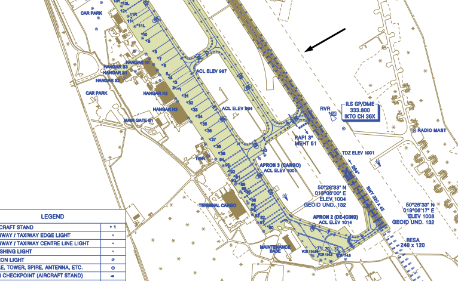

# Lotniska

Lotnisko jest podstawowym elementem infrastruktury lotniczej i miejscem, w którym rozpoczyna się oraz kończy większość operacji lotniczych. Dla kontrolera ruchu lotniczego oraz pilota znajomość budowy lotniska, jego elementów i stosowanego nazewnictwa jest niezbędna do prawidłowego wykonywania czynności operacyjnych. Zrozumienie przeznaczenia poszczególnych części lotniska ułatwia interpretację map lotniskowych, prowadzenie korespondencji radiowej oraz właściwe wykonywanie instrukcji kontroli ruchu lotniczego.

## Definicje

> **Lotnisko** (*aerodrome*) - wydzielony obszar (w tym wszystkie budynki, instalacje i urządzenia) na lądzie, na wodzie, na konstrukcji stałej albo na stałej lub pływającej konstrukcji pełnomorskiej, w całości lub w części przeznaczony do lądowań, startów i naziemnego lub nawodnego ruchu statków powietrznych

> **Pole ruchu naziemnego** (*movement area*) - Część lotniska przeznaczona do startów, lądowań i kołowania statków powietrznych, składająca się z pola manewrowego i płyt(y).

> **Pole manewrowe** (*manouvering area*) - Część lotniska, wyłączając płyty, przeznaczona do startów, lądowań i kołowania statków powietrznych.

:::info

*Pole manewrowe* jest szczególnie istotne z punktu widzenia ATC. To właśnie za bezpieczeństwo operacji prowadzonych w tej części lotniska (droga startowa i drogi kołowania) bezpośrednio odpowiada kontroler ruchu lotniczego.

:::

> **Pole wzlotów** (*landing area*) – część pola ruchu naziemnego przeznaczona do startu i lądowania statków powietrznych.

> **Droga startowa** (*runway*) – ściśle określona prostokątna powierzchnia na lotnisku lądowym przygotowana do startu i lądowania statków powietrznych.

> **Pas drogi startowej** (*runway strip*) – wyznaczona powierzchnia obejmująca drogę startową, przeznaczona do zmniejszenia ryzyka uszkodzenia statku powietrznego w przypadku zjechania z drogi startowej oraz zapewnienia bezpieczeństwa statku powietrznego przelatującego nad tą powierzchnią w czasie operacji startu lub lądowania

:::info

W tym miejscu warto zwrócić uwagę na nazewnictwo. Potocznie przyjęło się mówić *pas startowy*, jednak z punktu widzenia definicji opisujących elementy lotniska takie pojęcie w ogóle nie występuje.

Warto zauważyć, że droga startowa to nie jest po prostu całość betonowej lub asfaltowej powierzchni, z której startują statki powietrzne. Jest to tylko fragment tej powierzchni oznaczony liniami wymalowanymi w odpowiednim kolorze. Dla przykładu na lotnisku w Katowicach (EPKT) droga startowa to tylko ten fragment powierzchni, który znajduje się wewnątrz obwódki wyznaczonej przez białe linie.

Pas drogi startowej z kolei jest tworem bardziej abstrakcyjnym. Nie wyznaczają go żadne fizyczne granice a jedynie definicja. Powierzchnia wchodząca w skład pasa drogi startowej musi spełniać dodatkowe wymagania, takie jak minimalizacja występowania wysokich przeszkód, wymóg łamliwości i specjalnego oznaczania tych przeszkód, które już w pasie drogi startowej muszą się znaleźć (na przykład anteny systemu ILS). Kształt pasa drogi startowej najlepiej widać na mapach, przykładowo w EPKT jest to przerywana linia wokół drogi startowej.

:::

> **Droga kołowania** (*taxiway*) - Określona droga na lotnisku lądowym wyznaczona do kołowania statków powietrznych i zapewniająca połączenie między określonymi częściami lotniska.

> **Płyta postojowa** (*apron*) - Wydzielona dla postoju statków powietrznych część powierzchni lotniska lądowego, na której odbywa się wsiadanie lub wysiadanie pasażerów, załadowanie lub wyładowanie poczty lub towaru, zaopatrywanie w paliwo, parkowanie lub obsługa tych statków.

 

## Najważniejsze parametry

### Parametry lotniska

> **Kod ICAO lotniska** (*ICAO airport code*) - powszechnie używana nazwa czteroliterowego tzw. wskaźnika lokalizacji lotniska (*location indicator*), wykorzystywana między innymi przez służby ruchu lotniczego do planowania lotów czy adresowania depesz lotniczych. Listę wszystkich wskaźników lokalizacji można znaleźć w dokumencie *DOC7910 - Location indicators*.

> **Punkt odniesienia lotniska** (*aerodrome reference point - ARP*) - Punkt określający geograficzną lokalizację lotniska. To właśnie ten punkt znajdzie się w planie lotu, jeśli pilot wpisze *AEPKK*.

> **Elewacja lotniska** (*aerodrome elevation*) – wysokość najwyższego punktu na polu wzlotów, mierzona od średniego poziomu morza.

> **Kod referencyjny lotniska** (*aerodrome reference code*) - dwuczłonowy kod, składający się z cyfry i litery, pozwalający w łatwy sposób ustalić, czy  statek powietrzny może skorzystać z danego lotniska

Pierwszy człon kodu określa referencyjną długość startu (*reference field length*)

| Kod | referencyjna długość startu | typowy statek powietrzny |
|-----|-----------------------------|--------------------------|
| 1   | poniżej 800m                | DHC6, PA31               |
| 2   | 800m do < 1200m             | ATR42, DH8C              |
| 3   | 1200m do < 1800m            | S340, CRJ2               |
| 4   | powyżej 1800m               | B737, A320               |

Drugi człon kodu określa maksymalną dopuszczalną rozpiętość skrzydeł lub rozstaw kół podwozia statku powietrznego 

| Kod | referencyjna rozpiętość skrzydeł | typowy statek powietrzny                                  |
|-----|----------------------------------|-----------------------------------------------------------|
| A   | < 15m                            | PIPER PA-31/CESSNA 404 Titan                              |
| B   | 15m do < 24m                     | BOMBARDIER Regional Jet CRJ-200/DE HAVILLAND CANADA DHC-6 |
| C   | 24m do < 36m                     | BOEING 737-700/AIRBUS A-320/EMBRAER ERJ 190-100           |
| D   | 36m do < 52m                     | B767 Series/AIRBUS A-310                                  |
| E   | 52m do < 65m                     | B777 Series/B787 Series/A330 Family                       |
| F   | 65m do < 8-0m                    | 	BOEING 747-8/AIRBUS A-380-800                            |
 

### Parametry drogi startowej

**Kierunek drogi startowej** - kierunek geograficzny, w jakim zorientowana jest oś drogi startowej, np. 257°.

**Oznaczenie drogi startowej** - dwucyfrowa wartość wynikajaca z zaokrąglenia kierunku drogi startowej, np 26, 08. W przypadku równoległych dróg startowych do odróżnienia oznaczeń używa się liter L, R, C, (left, right, center), np. 26R, 26L, 26C.

**Długość i szerokość drogi startowej** - fizyczne wymiary drogi startowej, np. 2500x45m.

**Deklarowane długości** - zestaw czterech wartości określających długości dostępne do wykorzystania przez statki powietrzne w fazie startu i lądowania, wykorzystywane przez załogi do obliczeń osiągów statku powietrznego.
- **Rozporządzalna długość rozbiegu** (_Take-off run available - TORA_) – długość drogi startowej deklarowana jako odpowiednia do rozbiegu startującego samolotu.
- **Rozporządzalna długość startu** (_Take-off distance available - TODA_) – długość drogi startowej deklarowana jako odpowiednia do rozbiegu startującego samolotu, powiększona o ewentualne zabezpieczenie wydłużonego startu.
- **Rozporządzalna długość przerwanego startu** (_Accelerate-stop distance available - ASDA_) – dostępna długość rozbiegu, powiększona o ewentualne zabezpieczenie przerwanego startu.
- **Rozporządzalna długość lądowania** (_Landing distance available - LDA_) – długość drogi startowej deklarowana jako odpowiednia do lądowania samolotu

**Rodzaj nawierzchni** - asfalt, beton, trawa itd.

**Wytrzymałość nawierzchni** - zdolność do przenoszenia obciążeń wynikających z wykorzystania drogi startowej przez dany statek powietrzny.

### Parametry dróg kołowania

Dopuszczalne kategorie statków powietrznych

### Parametry stanowisk i płyt postojowych

Dopuszczalne kategorie statków powietrznych

## Gdzie szukać informacji

AIP. Link do AIP PL, info o AIP innych krajów, nie zawsze dostępne, nie zawsze darmowe

oficjalna dokumentacja

skybrary

alternatywy
- navigraph
- chartfox
- littlenavmap

## Kategorie lotnisk
Lotniska możemy podzielić na kategorie w zależności od różnych czynników:
- kontrolowane (EPWA) i niekontrolowane (EPOD)
- cywilne (np. EPPO),  wojskowe (np. EPLK) lub mieszane (EPKK/EPWA)
- lądowe (EPGD) i wodne (???)

## Źródła
- Ustawa prawo lotnicze z 3 lipca 2002 roku
- Aneks 14 do Konwencji chicagowskiej
- Rozporządzenie UE 134/2014 - Łatwo Dostępne Przepisy dla Lotnisk
- Rozporządzenie UE 930/2012 SERA
- Zarządzanie ruchem lotniczym 4444
